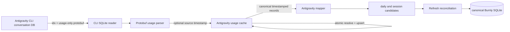

# Antigravity CLI Timestamp Recovery Engineering Proposal

## Status

Draft engineering proposal based on production reports and read-only inspection
of Antigravity CLI `1.1.18` artifacts on August 22, 2026.

This proposal corrects Antigravity CLI daily attribution when `gen_metadata`
contains exact token counters but no per-generation timestamp. It also defines
how Burnly repairs records already cached with the obsolete conversation-time
fallback. It is not an execution plan and does not approve implementation by
itself.

## Recommendation

Keep direct SQLite/protobuf ingestion as the authoritative Antigravity CLI usage
path. The token data is still present and exact; no live interceptor is needed.

Change timestamp handling so the normalized Antigravity usage cache resolves a
stable activity timestamp before records reach daily or session mapping:

1. Use the source-reported generation timestamp when it is present on the first
   observation of a record.
2. When it is absent, use the time Burnly first successfully observes that
   stable record.
3. Persist the timestamp origin and never move an already resolved record on a
   routine refresh.
4. Stop using conversation creation time or database modification time as daily
   attribution for timestamp-less usage records.
5. Repair provably affected legacy cache rows, bump the Antigravity mapping
   profile, and force one full Antigravity reconciliation after upgrade.

This preserves exact token totals while honestly treating the calendar date as
inferred when Antigravity no longer supplies it.

## Context And Verified Failure

Burnly reads Antigravity CLI conversation databases from
`~/.gemini/antigravity-cli/conversations/<conversation_id>.db`. The CLI reader
opens each database read-only and decodes usage-only protobuf fields from
`gen_metadata`; see
[`cli_sqlite_reader.rs`](../../../src-tauri/src/infrastructure/collectors/antigravity/cli_sqlite_reader.rs)
and
[`protobuf_usage.rs`](../../../src-tauri/src/infrastructure/collectors/antigravity/protobuf_usage.rs).

The previously observed protobuf shape included a generation timestamp at:

```text
gen_metadata.data
  -> chat_model field 1
  -> generation field 9
  -> timestamp field 4
```

Local inspection found a format transition within the same resumed
conversation:

| Evidence                                     | Result                                |
| -------------------------------------------- | ------------------------------------- |
| Last row with generation timestamp           | Index 1221, generated August 17, 2026 |
| First row without generation timestamp       | Index 1222                            |
| Consecutive timestamp-less rows inspected    | 38                                    |
| Antigravity CLI version writing the new rows | `1.1.18`                              |
| Exact token counters in new rows             | Present                               |
| Stable response IDs in new rows              | Present                               |

The same runtime was actively appending conversation data while Burnly reported
a healthy collection. Burnly's cache refreshed successfully and contained more
than two billion Antigravity CLI tokens, but the August 22 daily aggregate
remained at 35,567,205 tokens.

The failure is caused by current fallback behavior:

- `parse_gen_metadata_blob` substitutes the trajectory creation timestamp when
  the generation timestamp is absent.
- Resuming a conversation on a later day therefore dates every new response as
  the day the conversation was created.
- `map_daily` excludes that record when the substituted date falls outside the
  requested incremental scope.
- The normalized cache stores the substituted value as if it were an activity
  timestamp, so later refreshes preserve the wrong daily attribution.

This is a compatibility defect in Burnly exposed by upstream schema drift. It
is not loss of Antigravity token telemetry, a runtime-discovery failure, or a UI
cache problem.

The existing
[`antigravity-collector-engineering-proposal.md`](./antigravity-collector-engineering-proposal.md)
already states that modification time is diagnostic-only when a reliable usage
timestamp is unavailable. The implementation drifted from that constraint by
allowing a conversation-level fallback to participate in normal daily mapping.

## Goals

- Keep counting exact Antigravity-reported input, output, thinking-output, and
  cache-read tokens when generation timestamps are absent.
- Attribute newly observed timestamp-less records to a stable, defensible local
  date so resumed conversations continue increasing today's total.
- Repair users whose caches already contain new responses dated as the original
  conversation day.
- Preserve deterministic identity, idempotent refresh, and authoritative
  replacement semantics.
- Represent inferred activity time as lower-quality data without treating a
  supported upstream format as collector failure.
- Keep all parsing and persistence usage-only and local-first.

## Non-Goals

- Intercepting Antigravity network traffic, RPC calls, or TLS.
- Reading prompts, responses, tool calls, source code, or transcript content.
- Reconstructing the exact generation time when Antigravity did not persist it.
- Using database modification time for every row in a conversation.
- Estimating or collecting credits.
- Changing Antigravity token or cost calculation.
- Redesigning the tray UI or refresh scheduler beyond compatibility-triggered
  reconciliation.
- Promoting Antigravity from experimental status.

## Design Constraints And Invariants

1. Antigravity remains the source of truth for token counters.
2. `response_id` remains the primary stable identity for a usage record.
3. Re-reading the same source record never increments or duplicates tokens.
4. A resolved activity timestamp is immutable during routine upserts.
5. A source-reported timestamp is preferred only when available at initial
   resolution or when classifying an unambiguous legacy row.
6. First-seen time means Burnly's first successful durable observation, not a
   claim about the exact generation time.
7. Conversation creation time and file modification time may aid diagnostics,
   but must not silently become per-response activity time.
8. Timestamp resolution and cache upsert are one atomic operation.
9. Timestamp-less records must not reach daily mapping if the durable resolution
   operation fails.
10. No raw protobuf payload, prompt-bearing field, local path, or response ID is
    added to diagnostics or cloud sync.

## Proposed Data Model

### Parsed record

The protobuf parser should preserve whether a generation timestamp exists. It
must not replace absence with a session-level timestamp.

Conceptually, each parsed row carries:

```text
stable identity
exact token counters
model identity
source activity timestamp: optional
legacy session fallback timestamp: optional, repair context only
source record index: gen_metadata.idx
```

`read_gen_metadata_rows` should retain `gen_metadata.idx` instead of returning
only blobs. The response ID remains the preferred identity. When response ID is
absent, `(variant, conversation_id, gen_metadata.idx)` is a safer fallback than
the current token-value-derived key because token-identical responses can be
distinct.

### Normalized cache

Add an activity timestamp origin to `antigravity_usage_cache`:

```text
source_reported
first_seen
legacy_unknown
```

`observed_at_ms` remains the timestamp used for scope reads and mapping to avoid
an unnecessary broad schema rename, but its collector-specific meaning becomes
explicit: it is the resolved activity timestamp. Add the nullable source record
index needed for fallback identity.

Existing `first_seen_at_ms` and `last_seen_at_ms` retain their current meanings.
The migration sets existing rows to `legacy_unknown`; it must not rewrite their
dates without source evidence.

### Resolution rules

The cache store resolves each dedupe key transactionally:

| Cache state                | Current source timestamp                                                           | Resolution                                                                                                          |
| -------------------------- | ---------------------------------------------------------------------------------- | ------------------------------------------------------------------------------------------------------------------- |
| New record                 | Present                                                                            | Store it with `source_reported`                                                                                     |
| New record                 | Missing                                                                            | Store collection time with `first_seen`                                                                             |
| Existing `source_reported` | Any                                                                                | Preserve resolved timestamp and origin                                                                              |
| Existing `first_seen`      | Any                                                                                | Preserve resolved timestamp and origin                                                                              |
| Existing `legacy_unknown`  | Present                                                                            | Preserve existing value when equal; otherwise use the source timestamp and classify `source_reported` during repair |
| Existing `legacy_unknown`  | Missing and stored time equals the old deterministic conversation-created fallback | Replace it once with existing `first_seen_at_ms` and classify `first_seen`                                          |
| Existing `legacy_unknown`  | Missing and fallback cannot be proven                                              | Preserve it as `legacy_unknown` and emit a bounded diagnostic counter                                               |

The one-time legacy mutation is deliberately narrow. Rewriting every old row to
`first_seen_at_ms` would corrupt valid historical source timestamps. Leaving all
legacy rows untouched would fail to repair users already affected by this bug.

## Ownership And Runtime Flow

The normalized cache becomes the timestamp-resolution boundary. The parser owns
wire-format interpretation; the cache store owns stable identity, first-seen
time, and conflict resolution; the mapper consumes only resolved records.



The application port should expose one operation that atomically reconciles a
batch and returns the canonical cached records. A write-only `upsert` followed
by mapping the original in-memory rows is insufficient because the mapper would
still see unresolved timestamps. The interface should hide the SQL conflict
rules from the collector adapter.

If cache reconciliation fails:

- records with source-reported timestamps may continue through mapping;
- timestamp-less records are rejected from that result rather than assigned a
  conversation timestamp;
- the collection becomes partial, or fails when no usable records remain;
- diagnostics report counts and a stable failure code without identifiers.

The current ignored cache-write result must not remain silent once correctness
depends on durable timestamp resolution.

## Mapping And Data Quality

Daily mapping uses the resolved activity timestamp and the configured reporting
timezone. It no longer falls back to `ConversationDatabase.modified_at` for a
record that is expected to contribute to daily usage.

Token counts remain exact. Date quality differs:

- A bucket containing only `source_reported` records remains `complete`.
- A bucket containing any `first_seen` or unresolved legacy record is `partial`
  and carries a stable warning such as
  `antigravity.activity_time_first_seen`.
- Unresolved legacy rows remain visible only under their preserved date; they
  are not silently moved.

Session totals use the same canonical records. A session with inferred activity
times is likewise partial, even though its token total is exact.

The expected timestamp-less `1.1.18` shape should produce an informational
diagnostic, not a persistent health warning. Suggested redacted counters are:

- source-reported timestamp records;
- first-seen timestamp records;
- repaired legacy records;
- unresolved legacy records.

Only unresolved records or failed durable resolution should raise warning-level
health evidence.

## Upgrade And Existing-Data Recovery

This change alters daily attribution semantics, so increment the Antigravity
mapping profile from version 1 to version 2.

### Compatible baseline selection

The refresh planner currently treats any prior success for a source and
projection as a valid baseline. That is insufficient for collector
compatibility changes. Extend `ImportRunLookup` and successful-import matching
to include the collector key and expected profile version exposed by the
collector descriptor.

The planner already selects `CollectionScope::Full` when no compatible baseline
exists. Preserve that generic behavior:

```text
stored successful import: Antigravity profile 1
current collector profile: Antigravity profile 2
                       -> no compatible baseline
                       -> one full Antigravity refresh
successful profile-2 import recorded
                       -> later refreshes are incremental
```

Do not add an app-version condition or a one-off startup flag. Profile-aware
baseline selection is reusable compatibility infrastructure for future
collector changes. A profile mismatch must plan one full collection for the
affected source and projection, as already required by
[`refresh-policy.md`](../../product/refresh-policy.md) and
[`data-ingestion-design.md`](../../architecture/data-ingestion-design.md).

The profile-2 full reconciliation must:

1. Re-read discoverable Antigravity artifacts without loading prompt-bearing
   content.
2. Classify or repair legacy cache rows using the rules above.
3. Rebuild Antigravity daily and session candidates from canonical cache
   timestamps.
4. Let normal reconciliation update moved dates and model breakdowns.
5. Let the existing collect-sync outbox upload corrected active facts and
   missing/removed tombstones for signed-in users.

### Complete bounded rebuild

The full rebuild must process every discoverable Antigravity conversation. It
must not use the current 100-conversation adapter truncation and must not treat a
limit diagnostic as successful recovery.

Discovery should produce a deterministic order, and the collector should
process conversation paths in bounded batches. Each batch may parse and
atomically reconcile its normalized cache records before releasing raw protobuf
data. Cancellation is checked between batches. Daily/model accumulators and
session candidates should remain compact so full recovery does not require all
decoded records to remain in memory.

The cache may commit completed batches because its writes are idempotent, but
canonical daily and session reconciliation must not report an authoritative
full success until every batch completes. A read, parse, cache, cancellation,
or resource-limit failure before the final batch makes the import partial or
failed under the existing collector contract; it does not silently establish a
profile-2 baseline.

An interrupted repair is safe to retry because timestamp classification and
cache upsert are transactional per batch, resolved timestamps are stable, and
canonical reconciliation uses absolute replacement rather than increments.

### Fresh installations and code lifetime

A fresh installation has an empty Antigravity cache and no successful import
baseline. It therefore follows the existing initial full-refresh path, writes
new cache rows directly as `source_reported` or `first_seen`, and records a
profile-2 baseline. No legacy repair runs because no `legacy_unknown` rows
exist.

The profile-aware planner, bounded full collection, timestamp-origin model, and
idempotent reconciliation are permanent mechanisms. The profile-1
`legacy_unknown` classification branch is supported upgrade compatibility, not
an app-version special case. It may be removed only after Burnly no longer
supports direct upgrades from releases that wrote profile-1 Antigravity cache
rows and unresolved legacy rows have a separate recovery policy. Record that
retirement condition beside the compatibility branch when it is implemented.

## Privacy And Security

The existing Antigravity privacy boundary remains unchanged. Burnly may persist
only normalized usage counters, model labels, stable local identities, source
record indexes, timestamps, timestamp origin, and collector lifecycle metadata.

It must not persist or export:

- raw `gen_metadata` blobs;
- prompts, responses, tool inputs, or tool outputs;
- conversation content;
- local paths;
- raw response IDs in diagnostics;
- runtime authentication material.

Cloud sync continues to receive daily aggregates only. Timestamp origin and
local response identity remain local.

## Alternatives Considered

### Keep conversation creation time

Rejected. It deterministically assigns later responses in a resumed
conversation to the wrong day and caused the reported stuck total.

### Use conversation database modification time

Rejected for per-record attribution. The file time changes whenever any row is
written, so applying it to all rows moves historical usage forward on every
refresh. It remains useful only for discovering recently active databases.

### Assign collection time on every refresh

Rejected. The same response would move between dates and could be counted in
multiple scoped reconciliations. Only immutable first-seen time is stable.

### Drop timestamp-less records

Rejected. Antigravity still supplies exact token counters and stable identities;
discarding them would undercount usage more severely than an explicitly partial
date estimate.

### Add a live interceptor

Rejected. The required token counters already exist in durable local SQLite.
Interception adds process and privacy risk without restoring the missing
historical timestamp.

### Rewrite every existing cache timestamp to first-seen time

Rejected. Many existing rows contain valid source-reported generation times.
A blanket rewrite would corrupt accurate history.

## Risks And Mitigations

| Risk                                                                          | Mitigation                                                                            |
| ----------------------------------------------------------------------------- | ------------------------------------------------------------------------------------- |
| First observation occurs after the actual usage day because Burnly was closed | Mark the affected aggregate partial; do not claim exact generation time               |
| A legacy row cannot be classified safely                                      | Preserve it, count it diagnostically, and avoid speculative repair                    |
| Full repair is expensive for large histories                                  | Process every conversation in deterministic bounded batches with cancellation checks  |
| Profile upgrade moves usage between dates                                     | Use full authoritative reconciliation and existing cloud tombstone support            |
| Cache failure could reintroduce silent misdating                              | Make resolution failure explicit and reject unresolved rows from mapping              |
| Antigravity restores or changes timestamps again                              | Support both timestamped and timestamp-less rows indefinitely with sanitized fixtures |
| Timestamp-less rows lack response IDs in a future format                      | Preserve `gen_metadata.idx` as the stable conversation-local fallback identity        |

## Verification And Runtime Evidence

Implementation should be proven at the lowest stable boundaries described in
[`testing-strategy.md`](../../engineering/testing-strategy.md).

Required automated coverage:

- sanitized protobuf fixture with a source-reported timestamp;
- sanitized `1.1.18` fixture with exact tokens, response ID, and no timestamp;
- one conversation containing both old timestamped and new timestamp-less rows;
- resumed old conversation whose newly discovered tokens land on today's local
  date;
- repeated refresh preserving timestamp and token totals;
- timezone-boundary conversion of first-seen UTC time;
- cache conflict rules for all timestamp origins;
- migration from the current cache schema;
- provable legacy repair and ambiguous legacy preservation;
- cache failure producing partial/failure behavior without session-time
  fallback;
- profile-version mismatch planning a full refresh;
- full reconciliation correcting old and new daily identities without
  double-counting;
- collect-sync export including corrected facts and tombstones.

Runtime acceptance requires sanitized evidence from a real Antigravity CLI
`1.1.18` session:

1. Create usage in a conversation on day A.
2. Resume the same conversation on day B.
3. Verify day-B token growth while the conversation remains the same.
4. Refresh repeatedly and verify stable totals.
5. Restart Burnly and verify the resolved dates remain stable.
6. Upgrade a database containing affected legacy rows and verify automatic
   repair plus full reconciliation.

Run `pnpm verify`, the architecture harness, and the desktop runtime gate during
implementation. Command output and packaged evidence belong in the execution
plan and runtime-evidence artifact, not this proposal.

## Acceptance Criteria

- Antigravity CLI `1.1.18` timestamp-less rows contribute their exact tokens to
  the day Burnly first durably observes them.
- Resuming an old conversation increases the current day's Burnly total.
- Repeated refreshes and restarts do not move or duplicate those records.
- Source-timestamped historical rows retain their original dates.
- Provably affected existing cache rows are repaired automatically after
  upgrade.
- The profile upgrade causes a complete Antigravity reconciliation exactly when
  the stored baseline is incompatible.
- Full compatibility reconciliation processes every discoverable conversation
  in bounded batches and records no profile-2 baseline after partial execution.
- Fresh installations establish profile 2 directly and never enter legacy
  repair unless legacy rows actually exist.
- Daily and session candidates with inferred dates are marked partial while
  preserving exact token semantics.
- Cache-resolution failures cannot silently fall back to conversation creation
  or database modification time.
- Diagnostics distinguish expected timestamp absence, repaired legacy rows,
  unresolved legacy rows, and storage failure without exposing user content or
  identifiers.
- Signed-in users receive corrected aggregate facts and tombstones through the
  existing outbox; signed-out users remain fully local.

## Open Question

It is not yet verified whether Antigravity CLI `1.1.18` omits generation
timestamps on every supported OS or whether the change also applies to current
Antigravity App/IDE artifacts. The recommended default is to implement the
timestamp-origin model in the shared normalized cache but enable and validate
the first-seen fallback first for CLI SQLite records. App/IDE behavior should
change only when a sanitized artifact proves the same shape.
