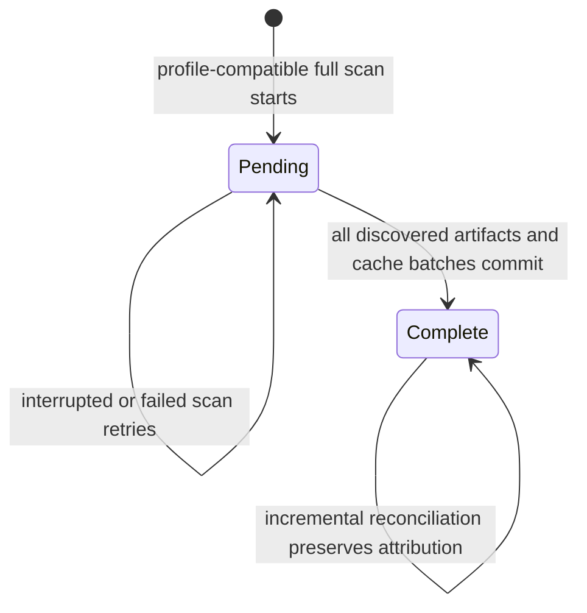

# OpenCode macOS Discovery And Antigravity Baseline Remediation Proposal

## Status

Draft engineering proposal based on a Burnly `0.1.29` production diagnostic
export from macOS on August 31, 2026 and repository inspection at the same date.

This document proposes two independently shippable corrections:

1. make OpenCode discovery and failure classification reliable on macOS; and
2. stop a fresh Burnly installation from assigning all pre-existing,
   timestamp-less Antigravity usage to the installation day.

It is not an execution plan and does not authorize implementation or release.

## Recommendation

Keep the tray's **Some sources failed** message for this report. It is truthful:
OpenCode failed both daily and session collection with
`source.invalid_location`. Fix the source failure rather than suppressing the
message.

Separately, introduce an explicit Antigravity baseline state. Usage records
that predate Burnly's first complete Antigravity scan and have no
source-reported activity timestamp should remain durable for identity and token
delta reconciliation, but must be excluded from calendar totals. Only
timestamp-less records first appearing after the baseline is complete should
use Burnly's durable first-observation time.

Ship the workstreams independently. OpenCode discovery must not depend on the
Antigravity migration, and the Antigravity correction must not wait for the
exact macOS OpenCode storage layout to be confirmed.

## Production Evidence

The report contains two defects with different owners and failure modes.

| Observation                                               | Evidence                                                                              | Interpretation                                                                                       |
| --------------------------------------------------------- | ------------------------------------------------------------------------------------- | ---------------------------------------------------------------------------------------------------- |
| Overall health is warning                                 | `diagnostics.recent_warnings` and `diagnostics.refresh_partial`                       | The warning is expected while a source target fails.                                                 |
| Every recent refresh is partial                           | Refreshes `2984` and `2986` through `2993` report `source.invalid_location`           | The failure is persistent, not a stale tray status.                                                  |
| OpenCode fails                                            | Diagnostic events identify `source: opencode` for daily and session projections       | OpenCode is the source behind **Some sources failed**.                                               |
| Other listed targets succeed                              | Latest import rows for Antigravity, Grok Build, Codex, and others are successful      | Refresh is partial because collection continues after an isolated target failure.                    |
| Antigravity imports succeed                               | Daily and session imports report zero rejected records                                | The large total is not caused by an Antigravity target failure.                                      |
| Antigravity contributes about 400 million tokens to today | The screenshot shows `400,094,530`; the later integrity total is `452,464,173`        | The current-day total is implausible for two new prompts and changes as more records are discovered. |
| Most scanned records lack a source activity timestamp     | Latest scan reports `7,064` first-seen records and `5,917` source-timestamped records | Burnly is dating a large historical cohort by observation time.                                      |
| Runtime metadata is unavailable                           | No process candidates or endpoints are found; cached data is used                     | This is a supported fallback path, not by itself a failure.                                          |
| Usage integrity balances                                  | Daily and per-model totals match; there are no orphan model rows                      | Aggregation is internally consistent after the incorrect date attribution.                           |

The three Antigravity model totals visible in the screenshot sum exactly to the
displayed `400,094,530` tokens. The UI is faithfully rendering the persisted
daily aggregate; this is not a frontend arithmetic defect.

The `sources.recent` entry for OpenCode says its latest import succeeded, but it
does not describe the current failed targets. It is historical source state and
must not override the latest refresh and diagnostic evidence.

## Root Causes

### OpenCode errors are collapsed into `source.invalid_location`

OpenCode discovery currently resolves one database path from, in order,
`OPENCODE_DB`, `XDG_DATA_HOME`, or `$HOME/.local/share`. The collector then
opens that path read-only.

The store distinguishes open, SQLite configuration, schema, snapshot, query,
and incompatible-row failures. The adapter discards that distinction: if the
resolved path exists, any open or schema error is reported as
`source.invalid_location`.

The production report therefore proves that OpenCode cannot use the selected
target, but it does **not** prove which of these is true:

- the automatic macOS location is wrong;
- the target is not a regular readable database;
- the app sandbox or filesystem permissions prevent access;
- the SQLite schema has changed; or
- a transient database/open condition is being misclassified.

A fix that merely adds a guessed macOS path would be under-specified and could
hide schema or permission failures behind another misleading location error.

### Antigravity confuses baseline observation with activity time

Antigravity parsing preserves exact usage counters when an upstream record has
no per-record activity timestamp. The normalized cache currently resolves a
new unresolved record to the refresh collection time and marks its origin
`first_seen`. Daily and session mapping then bucket that value into the local
calendar date.

That rule is defensible for a genuinely new record which appears after Burnly
has established a baseline. It is not defensible on the first scan. Every
pre-existing timestamp-less record is first seen by Burnly during installation,
regardless of when the underlying activity occurred. Assigning that entire
cohort to today explains the hundreds of millions of tokens shown after only
two prompts.

Token extraction, deduplication, and model aggregation may all be exact while
the current-day attribution is wrong. Data quality alone cannot correct the
total because partial records still participate in aggregation.

## Goals

- Discover a compatible OpenCode database on supported macOS installations
  without regressing Linux or explicit configuration.
- Preserve a truthful, actionable error when OpenCode cannot be collected.
- Distinguish path, permission, SQLite-open, and schema incompatibility stages
  without leaking local paths or usage content.
- Preserve exact Antigravity token counters and stable record identity.
- Exclude undated pre-installation Antigravity history from daily and session
  calendar totals.
- Continue counting genuinely new timestamp-less Antigravity records using a
  stable first-observation date with partial data quality.
- Repair the provably affected `0.1.29` cache cohort deterministically and
  correct already-materialized local and synced facts.
- Keep refresh idempotent, bounded, interruptible, and safe to retry.

## Non-Goals

- Hiding a real source failure by changing tray copy or status precedence.
- Treating `sources.recent` as the latest-refresh result.
- Guessing exact historical activity dates that Antigravity did not persist.
- Using conversation creation time or database modification time as a
  per-response activity timestamp.
- Changing token arithmetic, pricing, or model naming. The small `unknown`
  Antigravity model row is a separate normalization concern.
- Reading prompts, responses, tool calls, source code, or transcript content.
- Merging multiple OpenCode databases unless production evidence demonstrates
  that multiple stores are simultaneously authoritative.
- Promoting Antigravity from experimental status.
- Redesigning the tray status model already covered by the tray-summary status
  separation work.

## Shared Invariants

1. Collectors remain read-only against third-party source databases.
2. Rust application and domain layers remain independent of SQLite, Tauri, and
   collector envelopes.
3. One failed source target may make a refresh partial but must not discard
   successful targets.
4. Re-reading an unchanged source record never duplicates tokens.
5. Source-reported timestamps take precedence over inferred timestamps.
6. No raw local path, database row, prompt-bearing content, conversation ID, or
   response ID is written to diagnostics or cloud sync.
7. Compatibility recovery must be deterministic and safe after interruption.
8. Canonical daily facts and per-model facts must continue to reconcile to the
   same token total.

## Workstream A: OpenCode macOS Discovery And Error Classification

### Evidence gate

Before settling the automatic candidate list, collect a sanitized diagnostic
from an affected packaged macOS build. The evidence should identify:

- candidate kind, such as explicit override, XDG, or platform default;
- whether the candidate is absent, a regular file, and readable;
- the stage that failed: discovery, open, SQLite configuration, schema probe,
  snapshot, query, or row compatibility; and
- schema capability flags needed by the existing v1/v2 reader.

It must not include an absolute path, table contents, record identifiers, or
SQL values. The repository and supplied report are insufficient to assert the
correct native macOS location, so the implementation should derive candidates
from an affected installation or authoritative OpenCode behavior rather than a
guess.

### Candidate discovery

Replace the single implicit path with deterministic candidate discovery and a
read-only compatibility probe.

- `OPENCODE_DB` remains an authoritative explicit override. If supplied and
  unusable, fail that target clearly; silently falling back would conceal a
  configuration error.
- Automatic candidates include the confirmed platform-native location plus the
  current XDG and home-relative locations where applicable.
- An absent automatic candidate is not an error because OpenCode is optional.
- An incompatible automatic candidate does not stop discovery when a later
  compatible candidate exists.
- Select the first compatible candidate under a documented, deterministic
  precedence.
- Do not aggregate multiple physical databases in this workstream. If evidence
  later shows distinct desktop and CLI stores are both authoritative, address
  identity and double-count prevention in a separate proposal.

The compatibility probe should reuse the store's schema inspection rather than
copying knowledge into the discovery layer. Candidate discovery owns ordering;
the OpenCode store owns whether a database is readable and structurally
supported.

### Failure taxonomy

Preserve the most actionable terminal failure after candidate probing:

| Failure                                  | Public classification             | Diagnostic context                          |
| ---------------------------------------- | --------------------------------- | ------------------------------------------- |
| No automatic candidate exists            | Successful empty optional source  | Candidate kinds checked                     |
| Explicit path absent or not a file       | `source.invalid_location`         | Explicit candidate kind and discovery stage |
| Filesystem access denied                 | `source.permission_denied`        | Candidate kind and open stage               |
| SQLite opens but schema is unsupported   | `collector.incompatible_envelope` | Candidate kind and schema capability flags  |
| Snapshot/query/row shape is incompatible | `collector.incompatible_envelope` | Bounded stage and capability counters       |
| Compatible candidate succeeds            | Successful collection             | Selected candidate kind only                |

When every automatic candidate is present but unusable, report the
highest-signal failure deterministically and retain bounded per-candidate
diagnostic counters. Do not reduce all existing-path errors to
`source.invalid_location`.

### Operational behavior

This change does not alter refresh isolation: OpenCode failure still produces a
partial refresh while other targets commit successfully. Once OpenCode daily
and session projections succeed, the source-failure portion of tray status
clears on the next completed refresh.

## Workstream B: Antigravity Baseline Attribution

### Attribution model

Persist calendar eligibility separately from timestamp origin. Extend the
normalized Antigravity cache with an attribution classification equivalent to:

```text
dated
undated_baseline
```

Existing `timestamp_origin` continues to explain where `observed_at_ms` came
from (`source_reported`, `first_seen`, or `legacy_unknown`). The new
classification answers a different question: whether the record may
participate in a calendar aggregate. Keeping the dimensions separate avoids
overloading the existing origin constraint and preserves audit history.

Resolution becomes:

| Record state                            | Source activity timestamp | Attribution                                                                   |
| --------------------------------------- | ------------------------- | ----------------------------------------------------------------------------- |
| Seen during initial baseline            | Present                   | `dated`, using the source timestamp                                           |
| Seen during initial baseline            | Missing                   | `undated_baseline`; retain tokens and identity but exclude from dated mapping |
| First appears after baseline completion | Present                   | `dated`, using the source timestamp                                           |
| First appears after baseline completion | Missing                   | `dated`, using durable first observation and partial quality                  |
| Existing resolved record                | Any later observation     | Preserve its resolved timestamp and attribution during routine refresh        |

Conversation and file timestamps may remain diagnostic context, but they must
not silently make an undated baseline record calendar-eligible.

### Baseline state

Add durable Antigravity baseline state per supported source variant. The state
must cover variants with no artifacts during installation so that their later
first record is correctly recognized as post-baseline activity.



Use explicit baseline operations rather than a boolean mode parameter: begin a
baseline, reconcile a baseline batch, and complete the baseline. Cache writes
and their baseline progress must be transactional and idempotent. Mark a
variant complete only after full discovery and all its batches have committed.

The existing single-flight refresh coordinator prevents competing baselines.
If a refresh is interrupted, state remains pending and the next full refresh
retries safely; it must never reinterpret a partially scanned corpus as newly
created activity.

### Existing-data recovery

Bump the Antigravity collector profile so the refresh planner schedules a full
reconciliation after upgrade.

For installations already affected by the first-seen rollout, identify the
bootstrap cohort using durable local evidence:

1. find the first successful Antigravity import interval under the current
   profile;
2. select Antigravity cache rows whose origin is `first_seen` and whose durable
   first-seen time falls inside that interval; and
3. reclassify only that cohort as `undated_baseline`.

Source-timestamped rows remain dated. First-seen rows outside the unambiguous
bootstrap interval remain unchanged because they may represent genuine later
activity.

If an installation lacks an unambiguous successful bootstrap interval, do not
rewrite history heuristically. Complete a new baseline for future correctness
and emit a bounded `antigravity.baseline_repair_skipped` diagnostic. This
protects legitimate first-seen history at the cost of leaving an old aggregate
for manual or later evidence-based repair.

This recovery has one unavoidable edge case: a genuinely new timestamp-less
response created during the original first full scan is indistinguishable from
the pre-existing corpus and may become undated. Excluding that narrow interval
is preferable to claiming that an entire historical corpus occurred today.

### Mapping and canonical correction

Daily and session mappers must ignore `undated_baseline` records. The records
remain in the normalized cache so their identity and exact counters prevent
duplication and allow later records to be detected.

The profile migration must correct the affected canonical dates immediately.
Routine reconciliation intentionally uses a two-observation
`active -> missing -> removed` policy, and `missing` rows still contribute to
tray totals. Reusing that policy would leave a zero-result inflated day visible
for another refresh.

Define a compatibility-repair replacement operation that authoritatively
replaces or tombstones only Antigravity daily and session keys affected by the
bootstrap cohort. Keep this operation separate from routine absence handling;
do not add a behavioral boolean to the normal reconciler. The repair and the
new profile import must be idempotent if the process stops between them.

For signed-in users, enqueue corrected facts or tombstones through the existing
collect-sync outbox after local canonical repair. Otherwise an already-uploaded
inflated day could return from cloud state even after local cache correction.

### Data quality and diagnostics

Source-reported dated records remain complete. Post-baseline `first_seen`
records remain calendar-eligible but partial because their token counters are
exact while their activity time is inferred. Undated baseline records are not
partial daily data; they are intentionally outside any daily candidate.

Add bounded counters for:

- records classified as undated baseline;
- dated source-reported records;
- dated post-baseline first-seen records;
- baseline variants completed or retried; and
- legacy repair applied or skipped.

These diagnostics must not contain raw paths, conversation IDs, response IDs,
model prompts, or source content.

## Persistence And Migration

The database migration should be additive and backward compatible:

- add the Antigravity calendar-attribution column with a compatibility-safe
  default for existing rows;
- add durable per-variant baseline state and repair version metadata;
- preserve current dedupe keys, exact counters, timestamps, and timestamp
  origins; and
- add only the indexes needed for bounded baseline repair and dated scope
  reads.

Do not classify every historical `first_seen` row as baseline in SQL migration
alone. The application-level repair requires refresh/import interval evidence
and must run transactionally with explicit diagnostics.

Database schema migration and collector profile compatibility serve different
purposes: the schema makes the new state representable, while the profile bump
forces source reconciliation and canonical replacement. Both are required.

## Privacy And Security

Both workstreams operate on local metadata and usage counters. They must retain
Burnly's existing privacy boundary:

- open source databases read-only;
- inspect only filesystem type/readability and schema capabilities for
  discovery;
- decode and persist usage-only Antigravity fields;
- redact absolute paths and record identifiers from diagnostics; and
- sync only canonical usage corrections or tombstones, never normalized source
  cache contents.

No new network interceptor, elevated permission request, or prompt-bearing
telemetry is justified.

## Delivery And Compatibility

The workstreams may share one release but must retain separate compatibility
and rollback boundaries.

### OpenCode validation matrix

- affected packaged and signed macOS build with the production schema;
- macOS with no OpenCode installation;
- macOS with a valid and invalid explicit `OPENCODE_DB` override;
- Linux default/XDG discovery regression coverage;
- supported OpenCode v1 and v2 schema fixtures;
- permission-denied, incompatible-schema, and busy/snapshot failure
  classification; and
- daily and session projections selecting the same compatible store.

### Antigravity validation matrix

- fresh install over a large historical timestamp-less corpus;
- fresh install with a mix of source timestamps and missing timestamps;
- new timestamp-less records after baseline completion;
- interruption between baseline batches and before completion;
- upgrade from profile 2 with an unambiguous bootstrap interval;
- upgrade where repair evidence is ambiguous;
- affected date with some remaining dated usage and with zero remaining dated
  usage;
- repeated full and incremental refreshes proving idempotence;
- local canonical replacement plus collect-sync correction; and
- packaged macOS and Linux runtime evidence using usage-only fixtures.

Repository verification should include the normal fast and full gates,
architecture checks, desktop runtime verification, and desktop evidence. Exact
commands and outcomes belong in the later execution plan, not this proposal.

## Rollout And Observability

Roll out with stable, bounded diagnostic codes that distinguish:

- OpenCode candidate absence, permission denial, and incompatibility;
- Antigravity baseline start, completion, retry, repair, and repair skip; and
- counts of calendar-eligible versus undated records.

After upgrade, expected evidence on the affected macOS installation is:

1. OpenCode daily and session imports either succeed or expose a specific,
   actionable non-location failure.
2. The refresh becomes succeeded once no other source target fails.
3. The historical Antigravity bootstrap cohort no longer contributes to today.
4. New timestamp-less Antigravity activity still increases today and is marked
   as inferred/partial usage rather than a source failure.
5. Daily and model totals continue to match, including after cloud correction.

Rollback of application code must not make the migrated database unreadable.
Older builds should tolerate additive columns and tables, but they will not
understand undated attribution. Therefore release rollback should prefer a
forward fix once baseline repair has run; operational release notes must call
out this asymmetry.

## Risks And Tradeoffs

| Risk                                                                       | Mitigation                                                                                   |
| -------------------------------------------------------------------------- | -------------------------------------------------------------------------------------------- |
| Guessing the macOS OpenCode path fixes one machine but misdiagnoses others | Require sanitized candidate and schema evidence before finalizing discovery.                 |
| Candidate probing selects an unrelated SQLite file                         | Require OpenCode schema compatibility, deterministic precedence, and no multi-store merge.   |
| Initial Antigravity scan is interrupted                                    | Persist pending state and retry the full baseline; never complete from partial discovery.    |
| Legitimate activity during the bootstrap window becomes undated            | Limit recovery to the provable first import interval and document the conservative tradeoff. |
| Inflated canonical rows remain as `missing`                                | Use a dedicated authoritative compatibility replacement/tombstone operation.                 |
| Cloud sync restores corrected local inflation                              | Enqueue corrected facts or tombstones through the existing outbox.                           |
| Diagnostics leak user filesystem or conversation details                   | Emit candidate kinds, stages, capability flags, and aggregate counters only.                 |
| Large histories make baseline repair expensive                             | Preserve bounded batches and indexes; make every batch retry-safe.                           |

## Acceptance Criteria

### OpenCode

- On the affected macOS installation, both OpenCode projections use a confirmed
  compatible database or report the precise failure class.
- A missing optional OpenCode installation produces an empty successful source,
  not a partial refresh.
- An invalid explicit override fails visibly and does not silently fall back.
- Permission and schema failures are no longer reported as invalid location.
- No diagnostic exposes an absolute path or source content.
- Existing supported Linux and OpenCode schema behavior remains unchanged.

### Antigravity

- A fresh installation does not assign pre-existing timestamp-less usage to the
  installation day.
- Source-timestamped baseline records remain assigned to their source dates.
- A timestamp-less record first appearing after baseline completion contributes
  exactly once to its durable first-observation date and remains partial
  quality.
- An interrupted baseline can retry without duplicates or premature completion.
- The affected profile-2 bootstrap cohort is repaired only when the first import
  interval is unambiguous.
- Inflated canonical dates are corrected or tombstoned in the same compatibility
  recovery, including dates that become empty.
- Local daily and per-model totals remain equal after repair.
- Signed-in installations enqueue the corresponding cloud corrections.

### User-visible outcome

- **Some sources failed** remains visible while OpenCode genuinely fails.
- It clears after OpenCode succeeds and no other source has failed.
- Inferred post-baseline Antigravity usage is represented as estimated/partial
  usage by the separated tray status model, not as a source failure.
- The tray no longer reports hundreds of millions of historical Antigravity
  tokens as usage from two prompts today.

## High-Level Delivery Phases

These are decision boundaries, not an execution checklist:

1. Establish sanitized OpenCode macOS location/schema evidence and freeze the
   candidate precedence.
2. Ship OpenCode candidate probing and error taxonomy with cross-platform
   regression coverage.
3. Add Antigravity baseline persistence, attribution rules, and profile
   compatibility behavior.
4. Add deterministic profile-2 recovery, authoritative canonical correction,
   and collect-sync correction.
5. Validate both workstreams in packaged desktop runtimes before release.

## Open Questions

1. What exact candidate kind and schema does the affected macOS OpenCode
   installation expose? The recommended evidence gate must answer this before
   candidate precedence is finalized.
2. Should a future lifetime/history view expose the preserved undated baseline
   as an explicit **date unknown** total? This proposal preserves the records
   but excludes them from all current calendar views.
3. What retention window guarantees that the first successful profile-2 import
   interval remains available for every affected installation? If refresh
   history can be pruned before repair, the migration needs an additional
   conservative eligibility rule or must skip automatic repair.

None of these questions requires coupling the two workstreams. The default is
to gather OpenCode evidence, preserve undated Antigravity records locally, and
skip any historical rewrite that cannot be proven safe.

log source:

{
"schemaVersion": 1,
"generatedAt": "2026-08-31T06:34:24.363Z",
"app": {
"version": "0.1.29",
"platform": "macos",
"arch": "aarch64",
"debug": false
},
"environment": {
"timezone": "Asia/Jakarta",
"locale": "redacted-or-unset"
},
"health": {
"status": "warning",
"reasons": [
{
"code": "diagnostics.recent_warnings",
"message": "Burnly recorded recent local diagnostic warnings."
},
{
"code": "diagnostics.refresh_partial",
"message": "The latest refresh completed with partial data."
}
],
"generatedAt": "2026-08-31T06:34:24.363Z"
},
"database": {
"schemaVersion": 12,
"tablesPresent": true
},
"refresh": {
"latestRuns": [
{
"id": "2993",
"trigger": "manual",
"status": "partial",
"startedAt": "2026-08-31T06:33:22.552Z",
"finishedAt": "2026-08-31T06:33:25.545Z",
"requestedByAppVersion": "0.1.29",
"error": {
"code": "source.invalid_location",
"summary": "The configured source location is invalid."
}
},
{
"id": "2992",
"trigger": "manual",
"status": "partial",
"startedAt": "2026-08-31T06:31:18.190Z",
"finishedAt": "2026-08-31T06:31:21.264Z",
"requestedByAppVersion": "0.1.29",
"error": {
"code": "source.invalid_location",
"summary": "The configured source location is invalid."
}
},
{
"id": "2991",
"trigger": "scheduled",
"status": "partial",
"startedAt": "2026-08-31T06:23:55.421Z",
"finishedAt": "2026-08-31T06:23:58.853Z",
"requestedByAppVersion": "0.1.29",
"error": {
"code": "source.invalid_location",
"summary": "The configured source location is invalid."
}
},
{
"id": "2990",
"trigger": "scheduled",
"status": "partial",
"startedAt": "2026-08-31T05:23:33.369Z",
"finishedAt": "2026-08-31T05:23:36.817Z",
"requestedByAppVersion": "0.1.29",
"error": {
"code": "source.invalid_location",
"summary": "The configured source location is invalid."
}
},
{
"id": "2989",
"trigger": "manual",
"status": "partial",
"startedAt": "2026-08-31T05:19:39.834Z",
"finishedAt": "2026-08-31T05:19:42.794Z",
"requestedByAppVersion": "0.1.29",
"error": {
"code": "source.invalid_location",
"summary": "The configured source location is invalid."
}
},
{
"id": "2988",
"trigger": "manual",
"status": "partial",
"startedAt": "2026-08-31T05:08:49.224Z",
"finishedAt": "2026-08-31T05:08:51.858Z",
"requestedByAppVersion": "0.1.29",
"error": {
"code": "source.invalid_location",
"summary": "The configured source location is invalid."
}
},
{
"id": "2987",
"trigger": "scheduled",
"status": "partial",
"startedAt": "2026-08-31T05:08:33.326Z",
"finishedAt": "2026-08-31T05:08:36.501Z",
"requestedByAppVersion": "0.1.29",
"error": {
"code": "source.invalid_location",
"summary": "The configured source location is invalid."
}
},
{
"id": "2986",
"trigger": "launch",
"status": "partial",
"startedAt": "2026-08-31T04:53:51.684Z",
"finishedAt": "2026-08-31T04:53:55.874Z",
"requestedByAppVersion": "0.1.29",
"error": {
"code": "source.invalid_location",
"summary": "The configured source location is invalid."
}
},
{
"id": "2985",
"trigger": "resume",
"status": "failed",
"startedAt": "2026-08-31T04:08:06.632Z",
"finishedAt": "2026-08-31T04:53:32.855Z",
"requestedByAppVersion": "0.1.28",
"error": {
"code": "refresh.interrupted",
"summary": "The previous refresh was interrupted before it completed."
}
},
{
"id": "2984",
"trigger": "manual",
"status": "partial",
"startedAt": "2026-08-31T04:07:58.363Z",
"finishedAt": "2026-08-31T04:08:01.675Z",
"requestedByAppVersion": "0.1.28",
"error": {
"code": "source.invalid_location",
"summary": "The configured source location is invalid."
}
}
]
},
"imports": {
"latestRuns": [
{
"id": "47783",
"refreshRunId": "2993",
"sourceId": "zed",
"collectorKey": "zed",
"collectorVersion": "local",
"profileVersion": 1,
"projection": "session",
"scopeKind": "incremental",
"scopeStartDate": "2026-08-31",
"scopeEndDate": "2026-08-31",
"status": "succeeded",
"recordsSeen": "0",
"recordsRejected": "0",
"startedAt": "2026-08-31T06:33:22.552Z",
"finishedAt": "2026-08-31T06:33:25.545Z",
"error": null
},
{
"id": "47782",
"refreshRunId": "2993",
"sourceId": "zed",
"collectorKey": "zed",
"collectorVersion": "local",
"profileVersion": 1,
"projection": "daily",
"scopeKind": "incremental",
"scopeStartDate": "2026-08-31",
"scopeEndDate": "2026-08-31",
"status": "succeeded",
"recordsSeen": "0",
"recordsRejected": "0",
"startedAt": "2026-08-31T06:33:22.552Z",
"finishedAt": "2026-08-31T06:33:25.545Z",
"error": null
},
{
"id": "47781",
"refreshRunId": "2993",
"sourceId": "command-code",
"collectorKey": "command-code",
"collectorVersion": "local",
"profileVersion": 1,
"projection": "session",
"scopeKind": "incremental",
"scopeStartDate": "2026-08-31",
"scopeEndDate": "2026-08-31",
"status": "succeeded",
"recordsSeen": "0",
"recordsRejected": "0",
"startedAt": "2026-08-31T06:33:22.552Z",
"finishedAt": "2026-08-31T06:33:25.544Z",
"error": null
},
{
"id": "47780",
"refreshRunId": "2993",
"sourceId": "command-code",
"collectorKey": "command-code",
"collectorVersion": "local",
"profileVersion": 1,
"projection": "daily",
"scopeKind": "incremental",
"scopeStartDate": "2026-08-31",
"scopeEndDate": "2026-08-31",
"status": "succeeded",
"recordsSeen": "0",
"recordsRejected": "0",
"startedAt": "2026-08-31T06:33:22.552Z",
"finishedAt": "2026-08-31T06:33:25.543Z",
"error": null
},
{
"id": "47779",
"refreshRunId": "2993",
"sourceId": "grok-build",
"collectorKey": "grok-build",
"collectorVersion": "local",
"profileVersion": 1,
"projection": "session",
"scopeKind": "incremental",
"scopeStartDate": "2026-08-31",
"scopeEndDate": "2026-08-31",
"status": "succeeded",
"recordsSeen": "12",
"recordsRejected": "0",
"startedAt": "2026-08-31T06:33:22.552Z",
"finishedAt": "2026-08-31T06:33:25.540Z",
"error": null
},
{
"id": "47778",
"refreshRunId": "2993",
"sourceId": "grok-build",
"collectorKey": "grok-build",
"collectorVersion": "local",
"profileVersion": 1,
"projection": "daily",
"scopeKind": "incremental",
"scopeStartDate": "2026-08-31",
"scopeEndDate": "2026-08-31",
"status": "succeeded",
"recordsSeen": "0",
"recordsRejected": "0",
"startedAt": "2026-08-31T06:33:22.552Z",
"finishedAt": "2026-08-31T06:33:25.498Z",
"error": null
},
{
"id": "47777",
"refreshRunId": "2993",
"sourceId": "antigravity",
"collectorKey": "antigravity",
"collectorVersion": "local-rpc",
"profileVersion": 2,
"projection": "session",
"scopeKind": "incremental",
"scopeStartDate": "2026-08-31",
"scopeEndDate": "2026-08-31",
"status": "succeeded",
"recordsSeen": "8",
"recordsRejected": "0",
"startedAt": "2026-08-31T06:33:22.552Z",
"finishedAt": "2026-08-31T06:33:25.428Z",
"error": null
},
{
"id": "47776",
"refreshRunId": "2993",
"sourceId": "antigravity",
"collectorKey": "antigravity",
"collectorVersion": "local-rpc",
"profileVersion": 2,
"projection": "daily",
"scopeKind": "incremental",
"scopeStartDate": "2026-08-31",
"scopeEndDate": "2026-08-31",
"status": "succeeded",
"recordsSeen": "1",
"recordsRejected": "0",
"startedAt": "2026-08-31T06:33:22.552Z",
"finishedAt": "2026-08-31T06:33:24.962Z",
"error": null
},
{
"id": "47775",
"refreshRunId": "2993",
"sourceId": "zcode",
"collectorKey": "zcode",
"collectorVersion": "local",
"profileVersion": 1,
"projection": "session",
"scopeKind": "incremental",
"scopeStartDate": "2026-08-31",
"scopeEndDate": "2026-08-31",
"status": "succeeded",
"recordsSeen": "0",
"recordsRejected": "0",
"startedAt": "2026-08-31T06:33:22.552Z",
"finishedAt": "2026-08-31T06:33:23.968Z",
"error": null
},
{
"id": "47774",
"refreshRunId": "2993",
"sourceId": "zcode",
"collectorKey": "zcode",
"collectorVersion": "local",
"profileVersion": 1,
"projection": "daily",
"scopeKind": "incremental",
"scopeStartDate": "2026-08-31",
"scopeEndDate": "2026-08-31",
"status": "succeeded",
"recordsSeen": "0",
"recordsRejected": "0",
"startedAt": "2026-08-31T06:33:22.552Z",
"finishedAt": "2026-08-31T06:33:23.966Z",
"error": null
},
{
"id": "47773",
"refreshRunId": "2993",
"sourceId": "cline",
"collectorKey": "cline",
"collectorVersion": "local",
"profileVersion": 1,
"projection": "session",
"scopeKind": "incremental",
"scopeStartDate": "2026-08-31",
"scopeEndDate": "2026-08-31",
"status": "succeeded",
"recordsSeen": "0",
"recordsRejected": "0",
"startedAt": "2026-08-31T06:33:22.552Z",
"finishedAt": "2026-08-31T06:33:23.964Z",
"error": null
},
{
"id": "47772",
"refreshRunId": "2993",
"sourceId": "cline",
"collectorKey": "cline",
"collectorVersion": "local",
"profileVersion": 1,
"projection": "daily",
"scopeKind": "incremental",
"scopeStartDate": "2026-08-31",
"scopeEndDate": "2026-08-31",
"status": "succeeded",
"recordsSeen": "0",
"recordsRejected": "0",
"startedAt": "2026-08-31T06:33:22.552Z",
"finishedAt": "2026-08-31T06:33:23.963Z",
"error": null
},
{
"id": "47771",
"refreshRunId": "2993",
"sourceId": "pi",
"collectorKey": "ccusage",
"collectorVersion": "20.0.19",
"profileVersion": 1,
"projection": "session",
"scopeKind": "incremental",
"scopeStartDate": "2026-08-31",
"scopeEndDate": "2026-08-31",
"status": "succeeded",
"recordsSeen": "0",
"recordsRejected": "0",
"startedAt": "2026-08-31T06:33:22.552Z",
"finishedAt": "2026-08-31T06:33:23.960Z",
"error": null
},
{
"id": "47770",
"refreshRunId": "2993",
"sourceId": "pi",
"collectorKey": "ccusage",
"collectorVersion": "20.0.19",
"profileVersion": 1,
"projection": "daily",
"scopeKind": "incremental",
"scopeStartDate": "2026-08-31",
"scopeEndDate": "2026-08-31",
"status": "succeeded",
"recordsSeen": "0",
"recordsRejected": "0",
"startedAt": "2026-08-31T06:33:22.552Z",
"finishedAt": "2026-08-31T06:33:23.939Z",
"error": null
},
{
"id": "47769",
"refreshRunId": "2993",
"sourceId": "codex",
"collectorKey": "ccusage",
"collectorVersion": "20.0.19",
"profileVersion": 1,
"projection": "session",
"scopeKind": "incremental",
"scopeStartDate": "2026-08-31",
"scopeEndDate": "2026-08-31",
"status": "succeeded",
"recordsSeen": "0",
"recordsRejected": "0",
"startedAt": "2026-08-31T06:33:22.552Z",
"finishedAt": "2026-08-31T06:33:23.905Z",
"error": null
},
{
"id": "47768",
"refreshRunId": "2993",
"sourceId": "codex",
"collectorKey": "ccusage",
"collectorVersion": "20.0.19",
"profileVersion": 1,
"projection": "daily",
"scopeKind": "incremental",
"scopeStartDate": "2026-08-31",
"scopeEndDate": "2026-08-31",
"status": "succeeded",
"recordsSeen": "0",
"recordsRejected": "0",
"startedAt": "2026-08-31T06:33:22.552Z",
"finishedAt": "2026-08-31T06:33:23.444Z",
"error": null
},
{
"id": "47767",
"refreshRunId": "2993",
"sourceId": "claude-code",
"collectorKey": "ccusage",
"collectorVersion": "20.0.19",
"profileVersion": 1,
"projection": "session",
"scopeKind": "incremental",
"scopeStartDate": "2026-08-31",
"scopeEndDate": "2026-08-31",
"status": "succeeded",
"recordsSeen": "0",
"recordsRejected": "0",
"startedAt": "2026-08-31T06:33:22.552Z",
"finishedAt": "2026-08-31T06:33:22.666Z",
"error": null
},
{
"id": "47766",
"refreshRunId": "2993",
"sourceId": "claude-code",
"collectorKey": "ccusage",
"collectorVersion": "20.0.19",
"profileVersion": 1,
"projection": "daily",
"scopeKind": "incremental",
"scopeStartDate": "2026-08-31",
"scopeEndDate": "2026-08-31",
"status": "succeeded",
"recordsSeen": "0",
"recordsRejected": "0",
"startedAt": "2026-08-31T06:33:22.552Z",
"finishedAt": "2026-08-31T06:33:22.633Z",
"error": null
},
{
"id": "47765",
"refreshRunId": "2992",
"sourceId": "zed",
"collectorKey": "zed",
"collectorVersion": "local",
"profileVersion": 1,
"projection": "session",
"scopeKind": "incremental",
"scopeStartDate": "2026-08-31",
"scopeEndDate": "2026-08-31",
"status": "succeeded",
"recordsSeen": "0",
"recordsRejected": "0",
"startedAt": "2026-08-31T06:31:18.190Z",
"finishedAt": "2026-08-31T06:31:21.264Z",
"error": null
},
{
"id": "47764",
"refreshRunId": "2992",
"sourceId": "zed",
"collectorKey": "zed",
"collectorVersion": "local",
"profileVersion": 1,
"projection": "daily",
"scopeKind": "incremental",
"scopeStartDate": "2026-08-31",
"scopeEndDate": "2026-08-31",
"status": "succeeded",
"recordsSeen": "0",
"recordsRejected": "0",
"startedAt": "2026-08-31T06:31:18.190Z",
"finishedAt": "2026-08-31T06:31:21.263Z",
"error": null
},
{
"id": "47763",
"refreshRunId": "2992",
"sourceId": "command-code",
"collectorKey": "command-code",
"collectorVersion": "local",
"profileVersion": 1,
"projection": "session",
"scopeKind": "incremental",
"scopeStartDate": "2026-08-31",
"scopeEndDate": "2026-08-31",
"status": "succeeded",
"recordsSeen": "0",
"recordsRejected": "0",
"startedAt": "2026-08-31T06:31:18.190Z",
"finishedAt": "2026-08-31T06:31:21.263Z",
"error": null
},
{
"id": "47762",
"refreshRunId": "2992",
"sourceId": "command-code",
"collectorKey": "command-code",
"collectorVersion": "local",
"profileVersion": 1,
"projection": "daily",
"scopeKind": "incremental",
"scopeStartDate": "2026-08-31",
"scopeEndDate": "2026-08-31",
"status": "succeeded",
"recordsSeen": "0",
"recordsRejected": "0",
"startedAt": "2026-08-31T06:31:18.190Z",
"finishedAt": "2026-08-31T06:31:21.261Z",
"error": null
},
{
"id": "47761",
"refreshRunId": "2992",
"sourceId": "grok-build",
"collectorKey": "grok-build",
"collectorVersion": "local",
"profileVersion": 1,
"projection": "session",
"scopeKind": "incremental",
"scopeStartDate": "2026-08-31",
"scopeEndDate": "2026-08-31",
"status": "succeeded",
"recordsSeen": "12",
"recordsRejected": "0",
"startedAt": "2026-08-31T06:31:18.190Z",
"finishedAt": "2026-08-31T06:31:21.257Z",
"error": null
},
{
"id": "47760",
"refreshRunId": "2992",
"sourceId": "grok-build",
"collectorKey": "grok-build",
"collectorVersion": "local",
"profileVersion": 1,
"projection": "daily",
"scopeKind": "incremental",
"scopeStartDate": "2026-08-31",
"scopeEndDate": "2026-08-31",
"status": "succeeded",
"recordsSeen": "0",
"recordsRejected": "0",
"startedAt": "2026-08-31T06:31:18.190Z",
"finishedAt": "2026-08-31T06:31:21.212Z",
"error": null
},
{
"id": "47759",
"refreshRunId": "2992",
"sourceId": "antigravity",
"collectorKey": "antigravity",
"collectorVersion": "local-rpc",
"profileVersion": 2,
"projection": "session",
"scopeKind": "incremental",
"scopeStartDate": "2026-08-31",
"scopeEndDate": "2026-08-31",
"status": "succeeded",
"recordsSeen": "8",
"recordsRejected": "0",
"startedAt": "2026-08-31T06:31:18.190Z",
"finishedAt": "2026-08-31T06:31:21.138Z",
"error": null
},
{
"id": "47758",
"refreshRunId": "2992",
"sourceId": "antigravity",
"collectorKey": "antigravity",
"collectorVersion": "local-rpc",
"profileVersion": 2,
"projection": "daily",
"scopeKind": "incremental",
"scopeStartDate": "2026-08-31",
"scopeEndDate": "2026-08-31",
"status": "succeeded",
"recordsSeen": "1",
"recordsRejected": "0",
"startedAt": "2026-08-31T06:31:18.190Z",
"finishedAt": "2026-08-31T06:31:20.678Z",
"error": null
},
{
"id": "47757",
"refreshRunId": "2992",
"sourceId": "zcode",
"collectorKey": "zcode",
"collectorVersion": "local",
"profileVersion": 1,
"projection": "session",
"scopeKind": "incremental",
"scopeStartDate": "2026-08-31",
"scopeEndDate": "2026-08-31",
"status": "succeeded",
"recordsSeen": "0",
"recordsRejected": "0",
"startedAt": "2026-08-31T06:31:18.190Z",
"finishedAt": "2026-08-31T06:31:19.727Z",
"error": null
},
{
"id": "47756",
"refreshRunId": "2992",
"sourceId": "zcode",
"collectorKey": "zcode",
"collectorVersion": "local",
"profileVersion": 1,
"projection": "daily",
"scopeKind": "incremental",
"scopeStartDate": "2026-08-31",
"scopeEndDate": "2026-08-31",
"status": "succeeded",
"recordsSeen": "0",
"recordsRejected": "0",
"startedAt": "2026-08-31T06:31:18.190Z",
"finishedAt": "2026-08-31T06:31:19.724Z",
"error": null
},
{
"id": "47755",
"refreshRunId": "2992",
"sourceId": "cline",
"collectorKey": "cline",
"collectorVersion": "local",
"profileVersion": 1,
"projection": "session",
"scopeKind": "incremental",
"scopeStartDate": "2026-08-31",
"scopeEndDate": "2026-08-31",
"status": "succeeded",
"recordsSeen": "0",
"recordsRejected": "0",
"startedAt": "2026-08-31T06:31:18.190Z",
"finishedAt": "2026-08-31T06:31:19.718Z",
"error": null
},
{
"id": "47754",
"refreshRunId": "2992",
"sourceId": "cline",
"collectorKey": "cline",
"collectorVersion": "local",
"profileVersion": 1,
"projection": "daily",
"scopeKind": "incremental",
"scopeStartDate": "2026-08-31",
"scopeEndDate": "2026-08-31",
"status": "succeeded",
"recordsSeen": "0",
"recordsRejected": "0",
"startedAt": "2026-08-31T06:31:18.190Z",
"finishedAt": "2026-08-31T06:31:19.716Z",
"error": null
}
]
},
"sources": {
"recent": [
{
"sourceId": "antigravity",
"status": "enabled",
"latestImportStatus": "succeeded",
"latestProjection": "session"
},
{
"sourceId": "claude-code",
"status": "enabled",
"latestImportStatus": "succeeded",
"latestProjection": "session"
},
{
"sourceId": "cline",
"status": "enabled",
"latestImportStatus": "succeeded",
"latestProjection": "session"
},
{
"sourceId": "codex",
"status": "enabled",
"latestImportStatus": "succeeded",
"latestProjection": "session"
},
{
"sourceId": "command-code",
"status": "enabled",
"latestImportStatus": "succeeded",
"latestProjection": "session"
},
{
"sourceId": "grok-build",
"status": "enabled",
"latestImportStatus": "succeeded",
"latestProjection": "session"
},
{
"sourceId": "opencode",
"status": "enabled",
"latestImportStatus": "succeeded",
"latestProjection": "session"
},
{
"sourceId": "pi",
"status": "enabled",
"latestImportStatus": "succeeded",
"latestProjection": "session"
},
{
"sourceId": "zcode",
"status": "enabled",
"latestImportStatus": "succeeded",
"latestProjection": "session"
},
{
"sourceId": "zed",
"status": "enabled",
"latestImportStatus": "succeeded",
"latestProjection": "session"
}
]
},
"usageIntegrity": {
"todayDailyUsageRows": 1,
"todayDailyModelUsageRows": 3,
"todayDailyUsageTokenSum": "452464173",
"todayDailyModelUsageTokenSum": "452464173",
"orphanDailyModelRows": 0,
"modelRowsWithoutTotalTokens": 0
},
"diagnosticEvents": [
{
"id": "21668",
"area": "collector",
"severity": "info",
"code": "antigravity.collection_completed",
"summary": "Antigravity collection completed.",
"context": {
"appIdeSqliteConversationsAccepted": "0",
"appIdeSqliteConversationsRejected": "0",
"appIdeSqliteRecordsExtracted": "0",
"appIdeSqliteRecordsRejected": "0",
"cacheRecordsRead": "2810",
"cacheRecordsUsed": "2810",
"conversationArtifactsFound": "8",
"endpointsAccepted": "0",
"endpointsFound": "0",
"firstSeenTimestampRecords": "7064",
"identityProbesAttempted": "0",
"identityProbesSucceeded": "0",
"legacyRecordsRepaired": "0",
"metadataCallsAttempted": "0",
"metadataCallsSucceeded": "0",
"processCandidatesFound": "0",
"projection": "session",
"recordsExtracted": "12981",
"recordsRejected": "0",
"source": "antigravity",
"sourceReportedTimestampRecords": "5917",
"sqliteConversationsFailed": "0",
"sqliteConversationsParsed": "8",
"sqliteDbsScanned": "8",
"sqliteRecordsExtracted": "12981",
"sqliteRecordsRejected": "0",
"streamCallsAttempted": "0",
"streamsSucceeded": "0",
"unresolvedLegacyRecords": "0"
},
"createdAt": "2026-08-31T06:33:25.426Z"
},
{
"id": "21667",
"area": "collector",
"severity": "info",
"code": "antigravity.cache_used",
"summary": "Antigravity collection used cached usage records because runtime metadata was unavailable.",
"context": {
"appIdeSqliteConversationsAccepted": "0",
"appIdeSqliteConversationsRejected": "0",
"appIdeSqliteRecordsExtracted": "0",
"appIdeSqliteRecordsRejected": "0",
"cacheRecordsRead": "2810",
"cacheRecordsUsed": "2810",
"conversationArtifactsFound": "8",
"endpointsAccepted": "0",
"endpointsFound": "0",
"failureReason": "cache_used",
"firstSeenTimestampRecords": "7064",
"identityProbesAttempted": "0",
"identityProbesSucceeded": "0",
"legacyRecordsRepaired": "0",
"metadataCallsAttempted": "0",
"metadataCallsSucceeded": "0",
"processCandidatesFound": "0",
"projection": "session",
"recordsExtracted": "12981",
"recordsRejected": "0",
"source": "antigravity",
"sourceReportedTimestampRecords": "5917",
"sqliteConversationsFailed": "0",
"sqliteConversationsParsed": "8",
"sqliteDbsScanned": "8",
"sqliteRecordsExtracted": "12981",
"sqliteRecordsRejected": "0",
"streamCallsAttempted": "0",
"streamsSucceeded": "0",
"unresolvedLegacyRecords": "0"
},
"createdAt": "2026-08-31T06:33:25.425Z"
},
{
"id": "21666",
"area": "collector",
"severity": "info",
"code": "antigravity.collection_completed",
"summary": "Antigravity collection completed.",
"context": {
"appIdeSqliteConversationsAccepted": "0",
"appIdeSqliteConversationsRejected": "0",
"appIdeSqliteRecordsExtracted": "0",
"appIdeSqliteRecordsRejected": "0",
"cacheRecordsRead": "2810",
"cacheRecordsUsed": "2810",
"conversationArtifactsFound": "8",
"endpointsAccepted": "0",
"endpointsFound": "0",
"firstSeenTimestampRecords": "7064",
"identityProbesAttempted": "0",
"identityProbesSucceeded": "0",
"legacyRecordsRepaired": "0",
"metadataCallsAttempted": "0",
"metadataCallsSucceeded": "0",
"processCandidatesFound": "0",
"projection": "daily",
"recordsExtracted": "12981",
"recordsRejected": "0",
"source": "antigravity",
"sourceReportedTimestampRecords": "5917",
"sqliteConversationsFailed": "0",
"sqliteConversationsParsed": "8",
"sqliteDbsScanned": "8",
"sqliteRecordsExtracted": "12981",
"sqliteRecordsRejected": "0",
"streamCallsAttempted": "0",
"streamsSucceeded": "0",
"unresolvedLegacyRecords": "0"
},
"createdAt": "2026-08-31T06:33:24.959Z"
},
{
"id": "21665",
"area": "collector",
"severity": "info",
"code": "antigravity.cache_used",
"summary": "Antigravity collection used cached usage records because runtime metadata was unavailable.",
"context": {
"appIdeSqliteConversationsAccepted": "0",
"appIdeSqliteConversationsRejected": "0",
"appIdeSqliteRecordsExtracted": "0",
"appIdeSqliteRecordsRejected": "0",
"cacheRecordsRead": "2810",
"cacheRecordsUsed": "2810",
"conversationArtifactsFound": "8",
"endpointsAccepted": "0",
"endpointsFound": "0",
"failureReason": "cache_used",
"firstSeenTimestampRecords": "7064",
"identityProbesAttempted": "0",
"identityProbesSucceeded": "0",
"legacyRecordsRepaired": "0",
"metadataCallsAttempted": "0",
"metadataCallsSucceeded": "0",
"processCandidatesFound": "0",
"projection": "daily",
"recordsExtracted": "12981",
"recordsRejected": "0",
"source": "antigravity",
"sourceReportedTimestampRecords": "5917",
"sqliteConversationsFailed": "0",
"sqliteConversationsParsed": "8",
"sqliteDbsScanned": "8",
"sqliteRecordsExtracted": "12981",
"sqliteRecordsRejected": "0",
"streamCallsAttempted": "0",
"streamsSucceeded": "0",
"unresolvedLegacyRecords": "0"
},
"createdAt": "2026-08-31T06:33:24.959Z"
},
{
"id": "21664",
"area": "collector",
"severity": "warning",
"code": "collection.target_failed",
"summary": "Collection failed for one refresh target.",
"context": {
"failureCode": "source.invalid_location",
"projection": "session",
"source": "opencode"
},
"createdAt": "2026-08-31T06:33:23.918Z"
},
{
"id": "21663",
"area": "collector",
"severity": "warning",
"code": "opencode.collection_failed",
"summary": "OpenCode collection failed.",
"context": {
"counterRegressions": "0",
"deferredLiveRows": "0",
"exactRecordsAccepted": "0",
"failureCode": "source.invalid_location",
"lateExactIgnored": "0",
"lateExactReclassified": "0",
"messagePages": "0",
"messagesRead": "0",
"nonUsageErrorRows": "0",
"projection": "session",
"recoverySegmentsCreated": "0",
"sessionPages": "0",
"sessionsProcessed": "0",
"source": "opencode"
},
"createdAt": "2026-08-31T06:33:23.918Z"
},
{
"id": "21662",
"area": "collector",
"severity": "warning",
"code": "collection.target_failed",
"summary": "Collection failed for one refresh target.",
"context": {
"failureCode": "source.invalid_location",
"projection": "daily",
"source": "opencode"
},
"createdAt": "2026-08-31T06:33:23.915Z"
},
{
"id": "21661",
"area": "collector",
"severity": "warning",
"code": "opencode.collection_failed",
"summary": "OpenCode collection failed.",
"context": {
"counterRegressions": "0",
"deferredLiveRows": "0",
"exactRecordsAccepted": "0",
"failureCode": "source.invalid_location",
"lateExactIgnored": "0",
"lateExactReclassified": "0",
"messagePages": "0",
"messagesRead": "0",
"nonUsageErrorRows": "0",
"projection": "daily",
"recoverySegmentsCreated": "0",
"sessionPages": "0",
"sessionsProcessed": "0",
"source": "opencode"
},
"createdAt": "2026-08-31T06:33:23.910Z"
},
{
"id": "21660",
"area": "collector",
"severity": "info",
"code": "antigravity.collection_completed",
"summary": "Antigravity collection completed.",
"context": {
"appIdeSqliteConversationsAccepted": "0",
"appIdeSqliteConversationsRejected": "0",
"appIdeSqliteRecordsExtracted": "0",
"appIdeSqliteRecordsRejected": "0",
"cacheRecordsRead": "2782",
"cacheRecordsUsed": "2782",
"conversationArtifactsFound": "8",
"endpointsAccepted": "0",
"endpointsFound": "0",
"firstSeenTimestampRecords": "7036",
"identityProbesAttempted": "0",
"identityProbesSucceeded": "0",
"legacyRecordsRepaired": "0",
"metadataCallsAttempted": "0",
"metadataCallsSucceeded": "0",
"processCandidatesFound": "0",
"projection": "session",
"recordsExtracted": "12953",
"recordsRejected": "0",
"source": "antigravity",
"sourceReportedTimestampRecords": "5917",
"sqliteConversationsFailed": "0",
"sqliteConversationsParsed": "8",
"sqliteDbsScanned": "8",
"sqliteRecordsExtracted": "12953",
"sqliteRecordsRejected": "0",
"streamCallsAttempted": "0",
"streamsSucceeded": "0",
"unresolvedLegacyRecords": "0"
},
"createdAt": "2026-08-31T06:31:21.136Z"
},
{
"id": "21659",
"area": "collector",
"severity": "info",
"code": "antigravity.cache_used",
"summary": "Antigravity collection used cached usage records because runtime metadata was unavailable.",
"context": {
"appIdeSqliteConversationsAccepted": "0",
"appIdeSqliteConversationsRejected": "0",
"appIdeSqliteRecordsExtracted": "0",
"appIdeSqliteRecordsRejected": "0",
"cacheRecordsRead": "2782",
"cacheRecordsUsed": "2782",
"conversationArtifactsFound": "8",
"endpointsAccepted": "0",
"endpointsFound": "0",
"failureReason": "cache_used",
"firstSeenTimestampRecords": "7036",
"identityProbesAttempted": "0",
"identityProbesSucceeded": "0",
"legacyRecordsRepaired": "0",
"metadataCallsAttempted": "0",
"metadataCallsSucceeded": "0",
"processCandidatesFound": "0",
"projection": "session",
"recordsExtracted": "12953",
"recordsRejected": "0",
"source": "antigravity",
"sourceReportedTimestampRecords": "5917",
"sqliteConversationsFailed": "0",
"sqliteConversationsParsed": "8",
"sqliteDbsScanned": "8",
"sqliteRecordsExtracted": "12953",
"sqliteRecordsRejected": "0",
"streamCallsAttempted": "0",
"streamsSucceeded": "0",
"unresolvedLegacyRecords": "0"
},
"createdAt": "2026-08-31T06:31:21.136Z"
},
{
"id": "21658",
"area": "collector",
"severity": "info",
"code": "antigravity.collection_completed",
"summary": "Antigravity collection completed.",
"context": {
"appIdeSqliteConversationsAccepted": "0",
"appIdeSqliteConversationsRejected": "0",
"appIdeSqliteRecordsExtracted": "0",
"appIdeSqliteRecordsRejected": "0",
"cacheRecordsRead": "2781",
"cacheRecordsUsed": "2781",
"conversationArtifactsFound": "8",
"endpointsAccepted": "0",
"endpointsFound": "0",
"firstSeenTimestampRecords": "7035",
"identityProbesAttempted": "0",
"identityProbesSucceeded": "0",
"legacyRecordsRepaired": "0",
"metadataCallsAttempted": "0",
"metadataCallsSucceeded": "0",
"processCandidatesFound": "0",
"projection": "daily",
"recordsExtracted": "12952",
"recordsRejected": "0",
"source": "antigravity",
"sourceReportedTimestampRecords": "5917",
"sqliteConversationsFailed": "0",
"sqliteConversationsParsed": "8",
"sqliteDbsScanned": "8",
"sqliteRecordsExtracted": "12952",
"sqliteRecordsRejected": "0",
"streamCallsAttempted": "0",
"streamsSucceeded": "0",
"unresolvedLegacyRecords": "0"
},
"createdAt": "2026-08-31T06:31:20.676Z"
},
{
"id": "21657",
"area": "collector",
"severity": "info",
"code": "antigravity.cache_used",
"summary": "Antigravity collection used cached usage records because runtime metadata was unavailable.",
"context": {
"appIdeSqliteConversationsAccepted": "0",
"appIdeSqliteConversationsRejected": "0",
"appIdeSqliteRecordsExtracted": "0",
"appIdeSqliteRecordsRejected": "0",
"cacheRecordsRead": "2781",
"cacheRecordsUsed": "2781",
"conversationArtifactsFound": "8",
"endpointsAccepted": "0",
"endpointsFound": "0",
"failureReason": "cache_used",
"firstSeenTimestampRecords": "7035",
"identityProbesAttempted": "0",
"identityProbesSucceeded": "0",
"legacyRecordsRepaired": "0",
"metadataCallsAttempted": "0",
"metadataCallsSucceeded": "0",
"processCandidatesFound": "0",
"projection": "daily",
"recordsExtracted": "12952",
"recordsRejected": "0",
"source": "antigravity",
"sourceReportedTimestampRecords": "5917",
"sqliteConversationsFailed": "0",
"sqliteConversationsParsed": "8",
"sqliteDbsScanned": "8",
"sqliteRecordsExtracted": "12952",
"sqliteRecordsRejected": "0",
"streamCallsAttempted": "0",
"streamsSucceeded": "0",
"unresolvedLegacyRecords": "0"
},
"createdAt": "2026-08-31T06:31:20.675Z"
},
{
"id": "21656",
"area": "collector",
"severity": "warning",
"code": "collection.target_failed",
"summary": "Collection failed for one refresh target.",
"context": {
"failureCode": "source.invalid_location",
"projection": "session",
"source": "opencode"
},
"createdAt": "2026-08-31T06:31:19.672Z"
},
{
"id": "21655",
"area": "collector",
"severity": "warning",
"code": "opencode.collection_failed",
"summary": "OpenCode collection failed.",
"context": {
"counterRegressions": "0",
"deferredLiveRows": "0",
"exactRecordsAccepted": "0",
"failureCode": "source.invalid_location",
"lateExactIgnored": "0",
"lateExactReclassified": "0",
"messagePages": "0",
"messagesRead": "0",
"nonUsageErrorRows": "0",
"projection": "session",
"recoverySegmentsCreated": "0",
"sessionPages": "0",
"sessionsProcessed": "0",
"source": "opencode"
},
"createdAt": "2026-08-31T06:31:19.671Z"
},
{
"id": "21654",
"area": "collector",
"severity": "warning",
"code": "collection.target_failed",
"summary": "Collection failed for one refresh target.",
"context": {
"failureCode": "source.invalid_location",
"projection": "daily",
"source": "opencode"
},
"createdAt": "2026-08-31T06:31:19.668Z"
},
{
"id": "21653",
"area": "collector",
"severity": "warning",
"code": "opencode.collection_failed",
"summary": "OpenCode collection failed.",
"context": {
"counterRegressions": "0",
"deferredLiveRows": "0",
"exactRecordsAccepted": "0",
"failureCode": "source.invalid_location",
"lateExactIgnored": "0",
"lateExactReclassified": "0",
"messagePages": "0",
"messagesRead": "0",
"nonUsageErrorRows": "0",
"projection": "daily",
"recoverySegmentsCreated": "0",
"sessionPages": "0",
"sessionsProcessed": "0",
"source": "opencode"
},
"createdAt": "2026-08-31T06:31:19.665Z"
},
{
"id": "21652",
"area": "collector",
"severity": "info",
"code": "antigravity.collection_completed",
"summary": "Antigravity collection completed.",
"context": {
"appIdeSqliteConversationsAccepted": "0",
"appIdeSqliteConversationsRejected": "0",
"appIdeSqliteRecordsExtracted": "0",
"appIdeSqliteRecordsRejected": "0",
"cacheRecordsRead": "3024",
"cacheRecordsUsed": "3024",
"conversationArtifactsFound": "11",
"endpointsAccepted": "0",
"endpointsFound": "0",
"firstSeenTimestampRecords": "9854",
"identityProbesAttempted": "0",
"identityProbesSucceeded": "0",
"legacyRecordsRepaired": "0",
"metadataCallsAttempted": "0",
"metadataCallsSucceeded": "0",
"processCandidatesFound": "0",
"projection": "session",
"recordsExtracted": "16598",
"recordsRejected": "0",
"source": "antigravity",
"sourceReportedTimestampRecords": "6744",
"sqliteConversationsFailed": "0",
"sqliteConversationsParsed": "11",
"sqliteDbsScanned": "11",
"sqliteRecordsExtracted": "16598",
"sqliteRecordsRejected": "0",
"streamCallsAttempted": "0",
"streamsSucceeded": "0",
"unresolvedLegacyRecords": "0"
},
"createdAt": "2026-08-31T06:23:58.731Z"
},
{
"id": "21651",
"area": "collector",
"severity": "info",
"code": "antigravity.cache_used",
"summary": "Antigravity collection used cached usage records because runtime metadata was unavailable.",
"context": {
"appIdeSqliteConversationsAccepted": "0",
"appIdeSqliteConversationsRejected": "0",
"appIdeSqliteRecordsExtracted": "0",
"appIdeSqliteRecordsRejected": "0",
"cacheRecordsRead": "3024",
"cacheRecordsUsed": "3024",
"conversationArtifactsFound": "11",
"endpointsAccepted": "0",
"endpointsFound": "0",
"failureReason": "cache_used",
"firstSeenTimestampRecords": "9854",
"identityProbesAttempted": "0",
"identityProbesSucceeded": "0",
"legacyRecordsRepaired": "0",
"metadataCallsAttempted": "0",
"metadataCallsSucceeded": "0",
"processCandidatesFound": "0",
"projection": "session",
"recordsExtracted": "16598",
"recordsRejected": "0",
"source": "antigravity",
"sourceReportedTimestampRecords": "6744",
"sqliteConversationsFailed": "0",
"sqliteConversationsParsed": "11",
"sqliteDbsScanned": "11",
"sqliteRecordsExtracted": "16598",
"sqliteRecordsRejected": "0",
"streamCallsAttempted": "0",
"streamsSucceeded": "0",
"unresolvedLegacyRecords": "0"
},
"createdAt": "2026-08-31T06:23:58.731Z"
},
{
"id": "21650",
"area": "collector",
"severity": "info",
"code": "antigravity.collection_completed",
"summary": "Antigravity collection completed.",
"context": {
"appIdeSqliteConversationsAccepted": "0",
"appIdeSqliteConversationsRejected": "0",
"appIdeSqliteRecordsExtracted": "0",
"appIdeSqliteRecordsRejected": "0",
"cacheRecordsRead": "3024",
"cacheRecordsUsed": "3024",
"conversationArtifactsFound": "11",
"endpointsAccepted": "0",
"endpointsFound": "0",
"firstSeenTimestampRecords": "9854",
"identityProbesAttempted": "0",
"identityProbesSucceeded": "0",
"legacyRecordsRepaired": "0",
"metadataCallsAttempted": "0",
"metadataCallsSucceeded": "0",
"processCandidatesFound": "0",
"projection": "daily",
"recordsExtracted": "16598",
"recordsRejected": "0",
"source": "antigravity",
"sourceReportedTimestampRecords": "6744",
"sqliteConversationsFailed": "0",
"sqliteConversationsParsed": "11",
"sqliteDbsScanned": "11",
"sqliteRecordsExtracted": "16598",
"sqliteRecordsRejected": "0",
"streamCallsAttempted": "0",
"streamsSucceeded": "0",
"unresolvedLegacyRecords": "0"
},
"createdAt": "2026-08-31T06:23:58.080Z"
},
{
"id": "21649",
"area": "collector",
"severity": "info",
"code": "antigravity.cache_used",
"summary": "Antigravity collection used cached usage records because runtime metadata was unavailable.",
"context": {
"appIdeSqliteConversationsAccepted": "0",
"appIdeSqliteConversationsRejected": "0",
"appIdeSqliteRecordsExtracted": "0",
"appIdeSqliteRecordsRejected": "0",
"cacheRecordsRead": "3024",
"cacheRecordsUsed": "3024",
"conversationArtifactsFound": "11",
"endpointsAccepted": "0",
"endpointsFound": "0",
"failureReason": "cache_used",
"firstSeenTimestampRecords": "9854",
"identityProbesAttempted": "0",
"identityProbesSucceeded": "0",
"legacyRecordsRepaired": "0",
"metadataCallsAttempted": "0",
"metadataCallsSucceeded": "0",
"processCandidatesFound": "0",
"projection": "daily",
"recordsExtracted": "16598",
"recordsRejected": "0",
"source": "antigravity",
"sourceReportedTimestampRecords": "6744",
"sqliteConversationsFailed": "0",
"sqliteConversationsParsed": "11",
"sqliteDbsScanned": "11",
"sqliteRecordsExtracted": "16598",
"sqliteRecordsRejected": "0",
"streamCallsAttempted": "0",
"streamsSucceeded": "0",
"unresolvedLegacyRecords": "0"
},
"createdAt": "2026-08-31T06:23:58.080Z"
},
{
"id": "21648",
"area": "collector",
"severity": "warning",
"code": "collection.target_failed",
"summary": "Collection failed for one refresh target.",
"context": {
"failureCode": "source.invalid_location",
"projection": "session",
"source": "opencode"
},
"createdAt": "2026-08-31T06:23:56.681Z"
},
{
"id": "21647",
"area": "collector",
"severity": "warning",
"code": "opencode.collection_failed",
"summary": "OpenCode collection failed.",
"context": {
"counterRegressions": "0",
"deferredLiveRows": "0",
"exactRecordsAccepted": "0",
"failureCode": "source.invalid_location",
"lateExactIgnored": "0",
"lateExactReclassified": "0",
"messagePages": "0",
"messagesRead": "0",
"nonUsageErrorRows": "0",
"projection": "session",
"recoverySegmentsCreated": "0",
"sessionPages": "0",
"sessionsProcessed": "0",
"source": "opencode"
},
"createdAt": "2026-08-31T06:23:56.681Z"
},
{
"id": "21646",
"area": "collector",
"severity": "warning",
"code": "collection.target_failed",
"summary": "Collection failed for one refresh target.",
"context": {
"failureCode": "source.invalid_location",
"projection": "daily",
"source": "opencode"
},
"createdAt": "2026-08-31T06:23:56.678Z"
},
{
"id": "21645",
"area": "collector",
"severity": "warning",
"code": "opencode.collection_failed",
"summary": "OpenCode collection failed.",
"context": {
"counterRegressions": "0",
"deferredLiveRows": "0",
"exactRecordsAccepted": "0",
"failureCode": "source.invalid_location",
"lateExactIgnored": "0",
"lateExactReclassified": "0",
"messagePages": "0",
"messagesRead": "0",
"nonUsageErrorRows": "0",
"projection": "daily",
"recoverySegmentsCreated": "0",
"sessionPages": "0",
"sessionsProcessed": "0",
"source": "opencode"
},
"createdAt": "2026-08-31T06:23:56.668Z"
},
{
"id": "21644",
"area": "collector",
"severity": "info",
"code": "antigravity.collection_completed",
"summary": "Antigravity collection completed.",
"context": {
"appIdeSqliteConversationsAccepted": "0",
"appIdeSqliteConversationsRejected": "0",
"appIdeSqliteRecordsExtracted": "0",
"appIdeSqliteRecordsRejected": "0",
"cacheRecordsRead": "3008",
"cacheRecordsUsed": "3008",
"conversationArtifactsFound": "11",
"endpointsAccepted": "0",
"endpointsFound": "0",
"firstSeenTimestampRecords": "9838",
"identityProbesAttempted": "0",
"identityProbesSucceeded": "0",
"legacyRecordsRepaired": "0",
"metadataCallsAttempted": "0",
"metadataCallsSucceeded": "0",
"processCandidatesFound": "0",
"projection": "session",
"recordsExtracted": "16582",
"recordsRejected": "0",
"source": "antigravity",
"sourceReportedTimestampRecords": "6744",
"sqliteConversationsFailed": "0",
"sqliteConversationsParsed": "11",
"sqliteDbsScanned": "11",
"sqliteRecordsExtracted": "16582",
"sqliteRecordsRejected": "0",
"streamCallsAttempted": "0",
"streamsSucceeded": "0",
"unresolvedLegacyRecords": "0"
},
"createdAt": "2026-08-31T05:23:36.692Z"
},
{
"id": "21643",
"area": "collector",
"severity": "info",
"code": "antigravity.cache_used",
"summary": "Antigravity collection used cached usage records because runtime metadata was unavailable.",
"context": {
"appIdeSqliteConversationsAccepted": "0",
"appIdeSqliteConversationsRejected": "0",
"appIdeSqliteRecordsExtracted": "0",
"appIdeSqliteRecordsRejected": "0",
"cacheRecordsRead": "3008",
"cacheRecordsUsed": "3008",
"conversationArtifactsFound": "11",
"endpointsAccepted": "0",
"endpointsFound": "0",
"failureReason": "cache_used",
"firstSeenTimestampRecords": "9838",
"identityProbesAttempted": "0",
"identityProbesSucceeded": "0",
"legacyRecordsRepaired": "0",
"metadataCallsAttempted": "0",
"metadataCallsSucceeded": "0",
"processCandidatesFound": "0",
"projection": "session",
"recordsExtracted": "16582",
"recordsRejected": "0",
"source": "antigravity",
"sourceReportedTimestampRecords": "6744",
"sqliteConversationsFailed": "0",
"sqliteConversationsParsed": "11",
"sqliteDbsScanned": "11",
"sqliteRecordsExtracted": "16582",
"sqliteRecordsRejected": "0",
"streamCallsAttempted": "0",
"streamsSucceeded": "0",
"unresolvedLegacyRecords": "0"
},
"createdAt": "2026-08-31T05:23:36.692Z"
},
{
"id": "21642",
"area": "collector",
"severity": "info",
"code": "antigravity.collection_completed",
"summary": "Antigravity collection completed.",
"context": {
"appIdeSqliteConversationsAccepted": "0",
"appIdeSqliteConversationsRejected": "0",
"appIdeSqliteRecordsExtracted": "0",
"appIdeSqliteRecordsRejected": "0",
"cacheRecordsRead": "3008",
"cacheRecordsUsed": "3008",
"conversationArtifactsFound": "11",
"endpointsAccepted": "0",
"endpointsFound": "0",
"firstSeenTimestampRecords": "9838",
"identityProbesAttempted": "0",
"identityProbesSucceeded": "0",
"legacyRecordsRepaired": "0",
"metadataCallsAttempted": "0",
"metadataCallsSucceeded": "0",
"processCandidatesFound": "0",
"projection": "daily",
"recordsExtracted": "16582",
"recordsRejected": "0",
"source": "antigravity",
"sourceReportedTimestampRecords": "6744",
"sqliteConversationsFailed": "0",
"sqliteConversationsParsed": "11",
"sqliteDbsScanned": "11",
"sqliteRecordsExtracted": "16582",
"sqliteRecordsRejected": "0",
"streamCallsAttempted": "0",
"streamsSucceeded": "0",
"unresolvedLegacyRecords": "0"
},
"createdAt": "2026-08-31T05:23:36.061Z"
},
{
"id": "21641",
"area": "collector",
"severity": "info",
"code": "antigravity.cache_used",
"summary": "Antigravity collection used cached usage records because runtime metadata was unavailable.",
"context": {
"appIdeSqliteConversationsAccepted": "0",
"appIdeSqliteConversationsRejected": "0",
"appIdeSqliteRecordsExtracted": "0",
"appIdeSqliteRecordsRejected": "0",
"cacheRecordsRead": "3008",
"cacheRecordsUsed": "3008",
"conversationArtifactsFound": "11",
"endpointsAccepted": "0",
"endpointsFound": "0",
"failureReason": "cache_used",
"firstSeenTimestampRecords": "9838",
"identityProbesAttempted": "0",
"identityProbesSucceeded": "0",
"legacyRecordsRepaired": "0",
"metadataCallsAttempted": "0",
"metadataCallsSucceeded": "0",
"processCandidatesFound": "0",
"projection": "daily",
"recordsExtracted": "16582",
"recordsRejected": "0",
"source": "antigravity",
"sourceReportedTimestampRecords": "6744",
"sqliteConversationsFailed": "0",
"sqliteConversationsParsed": "11",
"sqliteDbsScanned": "11",
"sqliteRecordsExtracted": "16582",
"sqliteRecordsRejected": "0",
"streamCallsAttempted": "0",
"streamsSucceeded": "0",
"unresolvedLegacyRecords": "0"
},
"createdAt": "2026-08-31T05:23:36.060Z"
},
{
"id": "21640",
"area": "collector",
"severity": "warning",
"code": "collection.target_failed",
"summary": "Collection failed for one refresh target.",
"context": {
"failureCode": "source.invalid_location",
"projection": "session",
"source": "opencode"
},
"createdAt": "2026-08-31T05:23:34.721Z"
},
{
"id": "21639",
"area": "collector",
"severity": "warning",
"code": "opencode.collection_failed",
"summary": "OpenCode collection failed.",
"context": {
"counterRegressions": "0",
"deferredLiveRows": "0",
"exactRecordsAccepted": "0",
"failureCode": "source.invalid_location",
"lateExactIgnored": "0",
"lateExactReclassified": "0",
"messagePages": "0",
"messagesRead": "0",
"nonUsageErrorRows": "0",
"projection": "session",
"recoverySegmentsCreated": "0",
"sessionPages": "0",
"sessionsProcessed": "0",
"source": "opencode"
},
"createdAt": "2026-08-31T05:23:34.721Z"
}
]
}
