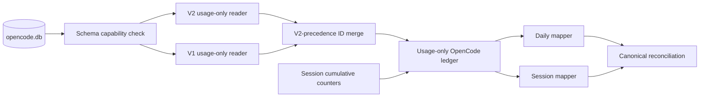

# Unified OpenCode V1 And V2 Collector Engineering Proposal

## Status

Draft engineering proposal based on repository inspection, upstream OpenCode
sources, and read-only inspection of locally installed OpenCode stable and
OpenCode 2 preview artifacts on August 22, 2026.

This proposal defines how Burnly should support both generations as one OpenCode
source. It is not an execution plan and does not approve implementation by
itself.

## Recommendation

Replace OpenCode's `ccusage` route with one native, read-only OpenCode collector
that understands both database generations.

Keep the existing product identity unchanged:

```text
source_key: opencode
display_name: OpenCode
collector_key: opencode
profile_version: 2
```

Do not add `opencode2` as a second Burnly source and do not add V1 and V2
aggregates together. Both applications use the same product identity and, by
default, the same `opencode.db`. The observed V2 migration retained stable
session and message IDs for almost all migrated history.

The merge rule is therefore:

1. Prefer a V2 record when the same message or session ID exists in both
   schemas.
2. Include V1 records whose stable IDs are absent from V2.
3. Reconcile the resulting usage against the source's cumulative session
   counters so V2 compaction or projection resets cannot silently remove usage.
4. Persist only a normalized, usage-only ledger; never retain source JSON or
   conversation content.

This treats OpenCode 2 as the successor storage generation of OpenCode, not as a
different coding agent. It also preserves V1 history and coexistence while the
preview migration remains incomplete.

## Why The Current Collector Misses OpenCode 2

Burnly currently routes `SourceKey::OpenCode` through bundled `ccusage 20.0.19`.
The adapter invokes `ccusage opencode daily` and `ccusage opencode session`,
then maps aggregate JSON through the OpenCode-specific ccusage envelopes and
mapper.

On the inspected machine:

| Component                | Installed version                     |
| ------------------------ | ------------------------------------- |
| Stable CLI/Desktop       | `1.18.15`                             |
| OpenCode 2 CLI/Desktop   | `0.0.0-beta-17898`                    |
| Bundled Burnly `ccusage` | `20.0.19`                             |
| Shared source database   | `~/.local/share/opencode/opencode.db` |

The OpenCode 2 CLI binary and the Desktop Beta sidecar were the same build and
both used the shared database. The V2 service held the database, WAL, and SHM
files open while usage was generated.

At 20:33 Asia/Jakarta on August 22, the V2 tables contained 164 assistant usage
records for that local day:

| Token category |    Tokens |
| -------------- | --------: |
| Input          | 1,332,603 |
| Output         |    29,566 |
| Reasoning      |     6,996 |
| Cache read     | 8,981,952 |
| Cache write    |         0 |

Against the same database and date, both pinned commands returned empty
collections and zero totals. `ccusage 20.0.19` reads the legacy `message` and
`session` tables, while new OpenCode 2 activity is written to `session_message`
and `session_v2`.

Waiting for `ccusage` would leave current preview usage invisible and would not
fix Burnly's existing OpenCode per-model limitation. Direct local ingestion is
the stronger long-term boundary because both schemas already expose the fields
Burnly needs.

## Local And Upstream Evidence

### Shared database and migration overlap

The local database snapshot contained:

| Evidence                 |     V1 |     V2 | Overlap | V1 only | V2 only |
| ------------------------ | -----: | -----: | ------: | ------: | ------: |
| Sessions                 |    557 |    562 |     557 |       0 |       5 |
| All messages             | 15,991 | 16,226 |  15,985 |       6 |     241 |
| Assistant usage messages | 14,631 | 14,790 |  14,626 |       5 |     164 |

All 14,626 overlapping assistant records had identical input, output,
reasoning, cache-read, cache-write, and cost values. This is strong evidence
that message ID is the correct cross-generation deduplication key.

V2 did not contain five historical V1 assistant records. Those records carried
non-zero usage, so choosing V2 exclusively would lose history. Conversely,
summing both schemas would count almost all historical usage twice.

The correct initial union is:

```sql
V2 assistant records
UNION ALL
V1 assistant records WHERE message.id is absent from session_message
```

The same V2-precedence anti-join applies to session identity. It must be built
behind typed store methods after schema validation, not exposed as ad hoc SQL to
the adapter.

### Schema comparison

The usage-bearing V1 shape is:

```text
session
  id, time_created, time_updated
  cost
  tokens_input, tokens_output, tokens_reasoning
  tokens_cache_read, tokens_cache_write

message
  id, session_id, time_created, time_updated, data JSON

message.data for role=assistant
  modelID, providerID
  time.created, time.completed
  tokens.input, tokens.output, tokens.reasoning
  tokens.cache.read, tokens.cache.write
  cost
```

The OpenCode 2 shape is:

```text
session_v2
  id, time_created, time_updated, time_idle
  cost
  tokens_input, tokens_output, tokens_reasoning
  tokens_cache_read, tokens_cache_write

session_message
  id, session_id, type, seq, time_created, time_updated, data JSON

session_message.data for type=assistant
  model.id, model.providerID, model.variant
  time.created, time.completed
  tokens.input, tokens.output, tokens.reasoning
  tokens.cache.read, tokens.cache.write
  cost
```

The V2 source code initializes the same five token counters on every session,
and its session projector maintains cumulative lifetime usage. The upstream V2
schema notes also call `session_message` an experimental projection that may be
reset while other history is preserved. See the official
[V2 schema changelog](https://github.com/anomalyco/opencode/blob/dev/specs/v2/schema-changelog.md)
and [current Session V2 implementation](https://github.com/anomalyco/opencode/blob/dev/packages/core/src/session.ts).

OpenCode's official troubleshooting guide places local application data under
`~/.local/share/opencode` on macOS/Linux and the corresponding `.local/share`
path on Windows. It also confirms that Desktop runs a local CLI sidecar. See
[OpenCode storage and Desktop behavior](https://dev.opencode.ai/docs/troubleshooting/).

An upstream coexistence report independently documents that stable and preview
executables currently open and migrate the same default database. The local
installation reproduced that topology. See
[OpenCode issue #42260](https://github.com/anomalyco/opencode/issues/42260).

### Provider identity is required

The inspected V2 data contained 29 distinct model IDs but 34 distinct
provider/model pairs. Four model IDs were used by more than one provider.

Provider therefore cannot remain display-only metadata. The collector must use
the source's conventional provider-qualified value:

```text
<providerID>/<modelID>
```

as `raw_model_id`. This is also consistent with OpenCode's public model naming.
Using only `modelID` would merge unrelated usage and cost.

`model.variant` is not part of the initial identity. It describes a selection
variant rather than a different provider model, V1 does not consistently expose
it, and Burnly's canonical model identity has no variant dimension. Preserve it
only in usage-local parsing if later evidence proves it changes attribution or
pricing.

### Message rows are detailed but not sufficient alone

The cumulative V2 session counters exceeded the sum of currently visible V2
assistant messages in four sessions. Those four sessions also had compaction
projection records. The total difference was:

| Token category | Difference |
| -------------- | ---------: |
| Input          |      6,433 |
| Output         |        339 |
| Reasoning      |        359 |
| Cache read     |        704 |
| Cache write    |          0 |

The legacy migration produced a similar apparent difference, but the V1-only
anti-join records explained it exactly. The remaining current difference shows
that V2 session aggregates preserve lifetime usage after detailed projected
messages are compacted or removed.

A stateless collector that sums only current messages will therefore regress
after compaction. A collector that reads only cumulative session rows preserves
totals but loses exact day and model attribution. The proposed normalized ledger
uses both.

## Goals

- Count stable OpenCode and OpenCode 2 CLI/Desktop usage under one OpenCode
  source.
- Preserve V1-only history without double-counting migrated V2 rows.
- Include new V2 usage even when no legacy row exists.
- Preserve exact provider/model, timestamp, token-category, and source-reported
  cost data when assistant records expose it.
- Preserve usage already observed before a disposable V2 projection compacts or
  resets detailed rows.
- Recover exact cumulative totals when detail disappeared before Burnly first
  observed it, while marking date and model attribution partial.
- Reconcile upgrades automatically and idempotently through the existing
  collector-profile baseline mechanism.
- Keep source content, credentials, project paths, and UI state outside Burnly's
  ingestion boundary.

## Non-Goals

- Adding `opencode2` as a separate source, toggle, or tray label.
- Summing V1 and V2 aggregate reports.
- Launching either OpenCode binary or depending on its background service.
- Calling OpenCode's HTTP/API session endpoints.
- Reading prompts, responses, reasoning text, tool content, shell output,
  instructions, session titles, project directories, or source code.
- Reading `auth.json`, `credential`, `account`, `control_account`, Desktop draft
  databases, logs, exports, or share secrets.
- Supporting arbitrary remote OpenCode servers or every isolated/portable data
  root in the first implementation.
- Representing reasoning as output tokens.
- Treating estimated cost as a subscription bill.
- Changing Pi's collection path beyond removing stale OpenCode naming from
  primitives Pi still reuses.

## Design Constraints And Invariants

1. `SourceKey::OpenCode` and its persisted string `opencode` remain unchanged.
2. V1 and V2 are storage generations, not separate product sources.
3. Stable message ID is the cross-generation deduplication identity; V2 wins on
   overlap.
4. A full import must process every discoverable session. No fixed conversation
   or message cap may silently establish a successful baseline.
5. Assistant message detail is preferred for timestamp and model attribution.
6. Cumulative session counters are the authoritative completeness guard for
   total tokens and source-reported cost.
7. Previously observed usage is not removed merely because V2 compaction drops a
   projected message.
8. Any total that cannot be attributed to a source message remains explicitly
   partial and uses a stable unattributed model identity.
9. Canonical total is the checked sum of input, output, reasoning, cache-read,
   and cache-write tokens. Reasoning remains canonical `unclassified_tokens`.
10. `tokens.cache.write` maps to canonical `cache_creation_tokens`.
11. Positive OpenCode `cost` is source-reported, estimated USD. Zero cost with
    positive usage follows Burnly's existing missing-cost and gap-fill policy.
12. Source reads are read-only, bounded, cancellable, and consistent with a live
    WAL database.
13. SQLite schema names, JSON paths, and merge rules remain private to the
    OpenCode infrastructure module.
14. No selected column or decoded JSON field may contain conversation content or
    credentials.

## Proposed Architecture

Add `src-tauri/src/infrastructure/collectors/opencode/` as one native collector
module with four internal responsibilities:

- discovery and schema capability detection;
- read-only V1/V2 snapshot extraction;
- transactional usage-ledger reconciliation;
- mapping normalized records to daily and session candidates.

The application-facing surface remains the existing `Collector` port. No new
IPC command, frontend state, source key, or canonical usage table is required.



`RoutedCollector` should own an `Arc<dyn Collector>` for OpenCode and route only
Claude Code, Codex, and Pi to `ccusage`. Composition should inject the same
diagnostic recorder and Burnly cost calculator policy used by other native
collectors.

## Discovery And Schema Gating

### Database location

Resolve the default data root from `XDG_DATA_HOME` when present, otherwise use
the OpenCode-documented `.local/share` location under the user profile. The
database path is `<data-root>/opencode/opencode.db`.

If Burnly itself receives an explicit `OPENCODE_DB` environment value, it may
use that exact file after ordinary path validation. Do not inspect another
process's environment to discover overrides.

An absent default database is normal optional-source absence and returns an
empty collection without a persistent warning. An existing but unreadable or
incompatible database returns a typed, redacted diagnostic.

Portable Desktop profiles, deliberately isolated `XDG_DATA_HOME` launches, and
remote server data are deferred. They require an explicit multi-location source
policy; recursively scanning a home directory would violate both performance
and privacy constraints.

### Capability detection

Never infer generation support from the installed executable version. Inspect
the database schema because stable and preview binaries currently coexist and
mutate one file.

Detect these capabilities independently:

- V1 session aggregate: required columns on `session`;
- V1 detail: required columns on `message` plus reviewed JSON paths;
- V2 session aggregate: required columns on `session_v2`;
- V2 detail: required columns on `session_message` plus reviewed JSON paths.

Supported combinations are:

| Detected shape | Behavior                                       |
| -------------- | ---------------------------------------------- |
| V1 only        | Collect V1 normally                            |
| V2 only        | Collect V2 normally                            |
| V1 and V2      | Merge by stable ID with V2 precedence          |
| Neither        | Incompatible schema, not a valid empty source  |
| Partial tables | Partial or failed import; never silent success |

Validate exact required columns before preparing extraction queries. Ignore
unrelated additive columns. Future incompatible field or table changes require
a new reviewed schema adapter and profile bump rather than heuristic fallback.

## Privacy-Preserving Extraction

Use the existing `open_external_read_only` helper and the bundled SQLite engine.
Set a bounded busy timeout and `query_only`; do not use `immutable=1` because an
active OpenCode process may have committed data in the WAL.

Extraction queries must name only these values:

- message ID and session ID;
- source message timestamps;
- provider ID and model ID;
- input, output, reasoning, cache-read, and cache-write counters;
- per-message source cost;
- session cumulative counters, cost, and lifecycle timestamps;
- V2 completion state needed to avoid snapshotting an in-flight response.

Use SQLite `json_extract` with an allowlist of reviewed paths. Do not select the
entire `data` column and do not deserialize broad upstream message structs.
Although SQLite must parse the JSON internally, prompt-bearing values never
cross into Burnly process memory.

In particular, no query may select `content`, user text, synthetic text,
compaction summaries, tool payloads, session title, directory, path, permission,
revert content, metadata, event payloads, part rows, auth tables, or Desktop UI
storage.

All counters must be integral, non-negative, and checked for overflow. Provider,
model, stable IDs, and source timestamps must be present for a record to receive
exact attribution. Invalid records are counted diagnostically without logging
their values.

## Unified Usage Ledger

### Why a ledger is required

OpenCode 2's current `session_message` table is a projection, not durable usage
history. Compaction can remove detailed assistant rows while `session_v2`
retains cumulative lifetime counters. A refresh after compaction cannot recover
the removed message's model and exact time from the current projection alone.

Burnly therefore needs a narrow local ledger containing usage facts only. This
is analogous to the existing normalized caches used where upstream source
artifacts are incomplete across observations; it is not a transcript cache.

### Message usage records

Conceptually, each ledger record contains:

```text
source message id
source session id
activity timestamp
provider-qualified raw model id
input, output, reasoning, cache-read, cache-write tokens
source-reported cost micros or unavailable
attribution origin: v1_message | v2_message | cumulative_recovery
data quality: complete | partial
first seen and last seen timestamps
```

V1 and V2 records with the same message ID occupy one ledger identity. A V2 row
updates the normalized record only when its validated usage shape is compatible;
the observed exact overlap means ordinary migration should be a no-op.

V1 records absent from V2 are retained. A source row disappearing later does not
delete an already observed message record by itself because compaction and beta
projection resets are known to remove detail without subtracting lifetime
usage.

### Session checkpoints and cumulative recovery

Maintain a usage-only checkpoint per source session containing the last accepted
cumulative token vector, cost micros, source update time, and reconciliation
state. Reconcile one session transactionally:

1. Read a consistent source snapshot for that session.
2. Merge V2 detail plus V1-only detail and upsert newly visible exact messages.
3. Sum the session's normalized ledger records.
4. Compare that sum with the preferred cumulative session header: V2 when
   present, otherwise V1.
5. If the cumulative header has a positive unexplained remainder, write one
   stable `cumulative_recovery` record for the delta and mark it partial.
6. Commit message rows, recovery rows, and the session checkpoint atomically.

For the initial import, the recovery timestamp is the latest safe source
lifecycle timestamp associated with the missing projection, when available;
otherwise it is Burnly's first durable observation time. The timestamp origin
must be persisted and remain stable across routine refreshes. The raw model ID
is a stable `OpenCode unattributed` identity; the collector must not guess the
session's current model.

On later refreshes, a cumulative increase not explained by newly observed
messages becomes a new immutable recovery segment at the source update or
first-observed time. This captures usage that was generated and compacted
between Burnly refreshes without moving an earlier segment.

If a late detailed message reappears after its usage was represented by a
recovery segment, totals must not increase. The ledger may replace recovery
usage with exact detail only when the token-and-cost vector can be consumed
without ambiguity; otherwise it preserves the recovery record and ignores the
late record for aggregation while reporting a redacted reclassification count.

### Counter decrease, revert, or projection reset

A cumulative session vector lower than the accepted ledger is not ordinary
compaction. It may indicate a source revert, a beta projection reset, or an
incompatible upstream change.

Do not insert negative usage and do not silently keep claiming a complete
session. Rebuild that session's normalized ledger from the current validated
snapshot, add at most one partial recovery record up to the new cumulative
total, and record a bounded `opencode.session_counter_regressed` diagnostic.
Canonical reconciliation then applies absolute replacement.

If the current snapshot cannot explain a non-negative token vector, fail or mark
the import partial and keep the last successful canonical baseline. A partial
repair must not authorize removal tombstones or a new profile baseline.

### Live writes

Read each source snapshot in one short read transaction. Ignore V2 assistant rows
whose completion state is absent and whose counters are still zero. If a session
has an in-flight response or its aggregate changes during validation, import
already durable exact rows but defer cumulative recovery for that session until
the next refresh.

This avoids turning a transient projector ordering difference into permanent
unattributed usage. Repeated collection is idempotent because stable message
IDs, checkpoint comparison, and recovery-segment identities use absolute source
state rather than increments applied outside the transaction.

## Mapping To Burnly's Canonical Model

### Token semantics

Map source counters as follows:

| OpenCode field       | Burnly field                    |
| -------------------- | ------------------------------- |
| `tokens.input`       | `input_tokens`                  |
| `tokens.output`      | `output_tokens`                 |
| `tokens.cache.write` | `cache_creation_tokens`         |
| `tokens.cache.read`  | `cache_read_tokens`             |
| `tokens.reasoning`   | included in total; unclassified |

Compute `total_tokens` with checked addition of all five source categories.
This is required because current V2 messages omit `tokens.total`; 161 inspected
V1 assistant rows also omitted it, and seven V1 totals disagreed with the five
explicit components. The explicit category vector is the common V1/V2 contract.

Do not fold reasoning into `output_tokens`. Because all four canonical
categories are known, `TokenUsage::new` will expose the positive difference as
`unclassified_tokens`, which honestly preserves the source-reported reasoning
amount until Burnly adds a first-class reasoning field.

The native profile marks input, output, cache creation, and cache read as
supported. Reasoning is source-supported but canonically unclassified; document
that distinction instead of marking it unavailable.

### Daily projection

Group normalized ledger records by configured timezone, local activity date,
and provider-qualified raw model ID. Daily source identity remains the existing
OpenCode date/timezone identity; model breakdowns carry exact model identities.

Exact V1/V2 message records produce complete model buckets. A day containing a
recovery record is partial and includes a separate `OpenCode unattributed`
breakdown. Daily aggregate tokens and cost must equal the sum of its model
breakdowns.

This closes the OpenCode half of the existing `Multiple models` limitation.
Pi remains on its current aggregate ccusage path and retains that limitation.

### Session projection

Group all normalized records by stable source session ID, with per-model
breakdowns inside one session candidate. Use the earliest and latest normalized
activity timestamps as session activity bounds. Do not import the source's
directory, project path, title, or slug.

The mapped session total must equal the accepted cumulative checkpoint. Recovery
usage appears under `OpenCode unattributed` and makes the session partial.

### Cost

OpenCode persists per-message and per-session `cost`. Treat positive values as
source-reported estimated USD and convert to integer micros deterministically.
The inspected overlapping V1/V2 messages had identical cost values.

For exact per-model messages, sum source-reported micros. For cumulative
recovery, use only the non-negative difference from the accepted source session
cost. A zero cost with positive tokens is unavailable unless the embedded
models.dev snapshot can gap-fill an exact model bucket under existing Burnly
policy. Unattributed recovery usage is not eligible for model-based cost
invention.

Switching from ccusage's collector-calculated estimate to OpenCode's own stored
estimate changes historical cost semantics. The profile-2 full rebuild makes
that change explicit and atomic. Product copy must continue to label all cost
as estimated, not billed.

## Collection Scope And Performance

The inspected source database was approximately 2.45 GB, but the required
tables contained only hundreds of sessions and tens of thousands of message
headers. The collector must avoid copying the database or loading JSON content.

For a full collection:

- enumerate every compatible session in deterministic ID order;
- process sessions in bounded batches;
- keyset-page message records by `(session_id, seq/id)`;
- reconcile each session ledger transactionally;
- release source rows after each batch;
- check cancellation between pages and sessions;
- build compact daily/session accumulators from normalized usage fields only.

For routine collection, scan lightweight session headers and read message detail
only when the source update timestamp or cumulative vector differs from the
stored checkpoint. Scope filtering happens on normalized activity timestamps,
but changed sessions must still be reconciled before filtering so compaction and
late completion cannot hide usage.

No fixed session count, API page default, or current ccusage date filter may
truncate a successful full baseline. A busy timeout, resource limit, parse
failure, or cancellation before exhaustion produces a partial/failed result and
does not advance the compatible baseline.

## Upgrade And Existing-Data Recovery

### Collector/profile transition

Remove OpenCode from the ccusage descriptor and route it to native collector key
`opencode` with profile version 2. The existing refresh planner matches both
collector key and profile version when locating a successful baseline. Existing
`ccusage`/profile-1 successes therefore do not count as a native profile-2
baseline.

The first post-upgrade refresh must run full daily and session collections for
OpenCode:

1. Read every compatible V1 and V2 session in bounded batches.
2. Build the V2-precedence message union and cumulative checkpoints.
3. Recover V1-only migration omissions.
4. Add partial cumulative recovery only for usage already absent from detailed
   projections.
5. Rebuild exact provider-qualified daily and session model breakdowns.
6. Let normal canonical reconciliation replace old ccusage candidates.
7. Let collect-sync publish corrected active facts and removal tombstones for
   signed-in users only after successful full reconciliation.

Because the stable `SourceKey::OpenCode` does not change, this is replacement of
one source projection, not creation of a second source history.

### Fresh installations

A fresh Burnly installation follows the same profile-2 full path with an empty
ledger and no legacy Burnly baseline. If the OpenCode database contains only V2
tables, the V1 branch is simply absent. If it contains both schemas, stable-ID
deduplication applies exactly as it does during upgrade.

There is no one-time app-version switch. Schema capability detection,
V2-precedence merging, cumulative completeness checks, and bounded full
collection are permanent collector behavior while Burnly supports both
generations.

### Removing stale ccusage OpenCode code

The transition should not leave two apparent OpenCode implementations.

After native contract parity is proven:

- remove OpenCode from `ccusage::profiles()` and `source_registry`;
- remove OpenCode command dispatch and envelope branches;
- remove OpenCode-only mapper tests and sidecar fixtures;
- update routed-collector tests to expect native OpenCode ownership;
- rename any report structs or helpers still genuinely shared by Pi to
  source-neutral or Pi-owned names;
- close the OpenCode portion of the known `Multiple models` limitation while
  retaining Pi's documented limitation.

Do not keep the ccusage OpenCode path as a fallback. Aggregate ccusage output has
no message IDs, so it cannot be safely deduplicated against native V2 usage.

## High-Level Delivery Sequence

Implement the proposal in six dependent chunks. These phases preserve the
design context and review boundaries; exact file changes, commands, progress,
and evidence belong in the active execution plan.

| Chunk                                 | Outcome                                                                                                                                                                                 | Dependency and exit condition                                                                                                                        |
| ------------------------------------- | --------------------------------------------------------------------------------------------------------------------------------------------------------------------------------------- | ---------------------------------------------------------------------------------------------------------------------------------------------------- |
| 1. Discovery and schema reader        | A privacy-safe native reader discovers the standard OpenCode database, validates V1/V2 capabilities, and emits normalized usage-only source snapshots                                   | Proves V1-only, V2-only, and combined databases without selecting prompt-bearing fields                                                              |
| 2. Usage ledger and recovery          | Burnly persists stable message facts, session checkpoints, and cumulative recovery segments transactionally                                                                             | Proves overlap deduplication, V1-only recovery, compaction retention, live-write deferral, counter regression, and retry idempotency                 |
| 3. Mapping and cost                   | Ledger records map to canonical daily/session candidates with provider-qualified models, complete token categories, reasoning as unclassified usage, and source-reported estimated cost | Proves aggregate/model equality, timezone behavior, partial unattributed recovery, and cost provenance                                               |
| 4. Collector and runtime wiring       | The native adapter owns detection, bounded collection, cancellation, diagnostics, bootstrap composition, and OpenCode routing                                                           | Proves successful collection through the existing `Collector` port without new IPC or frontend state                                                 |
| 5. Upgrade and ccusage retirement     | Profile 2 performs full existing-data reconciliation and OpenCode-specific ccusage ownership is removed or renamed where Pi still shares primitives                                     | Proves upgrade and fresh-install behavior, canonical replacement, sync tombstones, fail-closed partial imports, and absence of stale duplicate paths |
| 6. Runtime evidence and documentation | Real stable-only, V2-only, and combined installations validate live WAL reads, CLI/Desktop usage, compaction stability, privacy, rollback, and product documentation                    | Completes repository verification and supplies the evidence required to accept the implementation                                                    |

When implementation begins, create one roadmap execution plan covering these
six chunk contracts and one detailed plan for the current chunk. Later detailed
plans remain queued until their predecessor records its actual interfaces,
schema decisions, and verification evidence in the roadmap.

The engineering proposal remains the design source of truth. If implementation
evidence invalidates a merge rule, privacy boundary, token semantic, recovery
policy, or rollout decision, revise and review this proposal before allowing a
later execution plan to silently diverge from it.

## Diagnostics And Health

Use stable codes and counts only. Useful counters include:

- V1 exact records accepted;
- V2 exact records accepted;
- overlapping IDs deduplicated;
- V1-only records recovered;
- incomplete live rows deferred;
- cumulative recovery records and tokens;
- sessions whose counters regressed;
- malformed or unsupported usage rows;
- sessions and pages processed;
- database busy retries and collection duration.

Expected optional-source absence is silent. Expected coexistence and overlap are
informational. A day with cumulative recovery is data-quality partial but need
not keep global diagnostics health in warning indefinitely. Persistent counter
regression, incompatible required schema, or an incomplete full scan is a
warning/failure.

Diagnostics must not include database paths, message/session IDs, provider or
model names, project information, raw SQL rows, JSON payloads, or credentials.

## Alternatives Considered

### Add OpenCode 2 as a separate Burnly source

Rejected. The stable and preview products share the default database and stable
record identities. Separate sources would double-count migrated history and
fragment one product's successor transition across the UI and cloud facts.

### Sum V1 and V2 reports

Rejected. 14,626 local assistant records overlapped with identical usage. Sum
aggregation would duplicate nearly all migrated history.

### Prefer V2 and ignore V1

Rejected. The inspected migration omitted five historical usage-bearing V1
assistant records. Upstream also continues to describe parts of V2 storage as
experimental.

### Keep ccusage for V1 and add a native V2 collector

Rejected. ccusage returns only aggregates, while V2 deduplication requires
stable message IDs. There is no honest way to subtract migrated overlap from
the aggregate envelope.

### Read only assistant messages without a ledger

Rejected. Current V2 cumulative session counters already exceed visible message
detail after compaction. Stateless message summation will lose usage over time.

### Read only cumulative session rows

Rejected as the primary path. It preserves total usage but cannot produce exact
daily attribution or per-model breakdowns and would preserve the limitation the
native collector is meant to remove.

### Call the OpenCode 2 API or background service

Rejected. Collection must work offline when CLI/Desktop is not running, and a
service dependency adds lifecycle, port, authentication, pagination, and
versioning failure modes. The local database already holds the needed usage.

### Wait for upstream ccusage support

Rejected as the implementation direction. It delays current usage visibility,
does not guarantee stable-ID cross-generation deduplication, and retains an
extra subprocess/envelope boundary around data Burnly can read more precisely.

## Risks And Mitigations

| Risk                                                    | Mitigation                                                                                                                             |
| ------------------------------------------------------- | -------------------------------------------------------------------------------------------------------------------------------------- |
| V2 beta schema changes again                            | Strict capability gating, sanitized versioned fixtures, experimental-format diagnostics, and a profile bump for incompatible semantics |
| Stable and preview processes mutate one live database   | Short read-only WAL snapshots, bounded busy handling, no writes to the source database                                                 |
| Compaction removes detailed usage before Burnly sees it | Cumulative checkpoint recovery with stable partial attribution                                                                         |
| Previously observed detail disappears                   | Retain normalized message usage while cumulative counters remain compatible                                                            |
| Source revert or reset lowers cumulative totals         | Session-scoped ledger rebuild, partial result, and absolute canonical replacement; never negative usage                                |
| Provider/model IDs collide                              | Use provider-qualified raw model identity; local evidence proves model ID alone is insufficient                                        |
| Initial full scan is expensive                          | Header prefiltering, deterministic keyset pages, bounded session batches, cancellation checks, no content columns                      |
| Source-reported historical cost differs from ccusage    | Explicit profile-2 rebuild and unchanged estimated-cost product labeling                                                               |
| Portable or isolated data roots are missed              | Document the default-root boundary; add explicit multi-location configuration only with a separate reviewed policy                     |
| Recovery attribution overstates a day                   | Persist its source/first-seen origin, use a separate unattributed model bucket, and mark affected facts partial                        |
| Sensitive source data enters memory or fixtures         | Allowlisted scalar SQL extraction, privacy harness rules, sanitized minimal databases, no `SELECT *` or broad JSON structs             |

## Verification Strategy

Implementation must be proven at the narrowest stable boundaries in
[`testing-strategy.md`](../../engineering/testing-strategy.md).

### Store and schema tests

Use temporary real SQLite databases for:

- V1-only, V2-only, and combined schemas;
- the exact required-column capability matrix;
- V2-precedence overlap with identical usage;
- incompatible overlap failing safely;
- V1-only messages omitted by V2 migration;
- provider/model collisions;
- missing and conflicting V1 `tokens.total` values;
- malformed JSON, missing scalar paths, negative counters, and overflow;
- incomplete V2 rows and live WAL reads;
- bounded keyset pagination with more than one batch;
- cancellation before full exhaustion;
- source counter growth, compaction disappearance, late detail, regression, and
  retry idempotency;
- proof that extraction queries never select content-bearing columns.

Fixtures must use synthetic IDs, providers, models, timestamps, and paths. They
must contain no local prompts, responses, tool payloads, credentials, project
names, or session titles.

### Mapper and reconciliation tests

Cover:

- provider-qualified per-model daily and session breakdowns;
- timezone boundaries and multi-day sessions;
- reasoning retained exactly as unclassified tokens;
- cache write/read mapping;
- source-reported cost conversion and zero-cost fallback;
- partial unattributed recovery buckets;
- aggregate/model-breakdown equality;
- repeated refresh without duplication;
- profile-1/`ccusage` baseline mismatch planning one full profile-2 refresh;
- canonical replacement of `Multiple models` and unqualified legacy model rows;
- collect-sync corrected facts and tombstones after successful full recovery;
- no baseline or tombstones after a partial full scan.

### Runtime evidence

Record sanitized runtime evidence against stable OpenCode and OpenCode 2 on a
machine with both installed:

1. Confirm stable-only usage imports once.
2. Confirm migrated overlap does not change historical totals.
3. Confirm V1-only historical omissions remain counted.
4. Generate CLI and Desktop Beta usage and confirm both appear under OpenCode.
5. Compare current-day tokens to the reviewed direct SQL scalar query.
6. Trigger or observe compaction and confirm totals do not decrease.
7. Refresh while a response is active, then after completion, and confirm no
   duplicate recovery record.
8. Restart Burnly and both OpenCode applications and confirm stable totals.
9. Verify no prompt-bearing values appear in logs, cache, diagnostics export, or
   cloud payloads.

Run `pnpm verify`, `pnpm architecture:check`, and `pnpm verify:runtime` during
implementation. Commands and outcomes belong in the active execution plan, not
this proposal.

## Rollout And Rollback

Keep the existing OpenCode enablement state and user-facing source identity.
Treat V2 schema compatibility as experimental internally until runtime evidence
covers multiple preview builds and supported platforms; do not create a second
user-facing status row.

The Burnly migration only adds usage-ledger storage and does not modify the
OpenCode database. Rolling back Burnly leaves source data untouched. An older
Burnly build will resume the stale ccusage behavior and miss V2-only usage, but a
later profile-2 full refresh can reconstruct native facts from the source and
ledger. Document this temporary visibility regression in release notes if a
rollback is shipped.

Do not remove profile-1 canonical facts before a complete profile-2 daily and
session reconciliation succeeds. This makes an incompatible schema or partial
scan fail closed without blanking previously visible OpenCode history.

## Acceptance Criteria

- Stable OpenCode and OpenCode 2 usage appear under one `OpenCode` source.
- The local August 22 V2 fixture produces the five observed token categories
  while pinned ccusage parity proves the old path would return zero.
- Overlapping V1/V2 message IDs count once with V2 precedence.
- V1-only usage-bearing messages remain counted.
- V2-only CLI and Desktop usage is collected without either application
  running at refresh time.
- Provider-qualified model identities prevent cross-provider collisions and
  replace the old `Multiple models` OpenCode bucket.
- Input, output, cache-read, and cache-write counters remain exact; reasoning is
  preserved as unclassified rather than folded into output.
- Positive source cost is stored as source-reported estimated USD, with existing
  zero-cost fallback behavior preserved.
- Compaction cannot reduce already accepted usage while cumulative source
  counters remain compatible.
- Usage missing before first observation is recovered to exact totals under a
  stable partial `OpenCode unattributed` bucket.
- Counter regression, incompatible schema, busy database, cancellation, or
  bounded-resource failure cannot establish a successful full baseline.
- The profile transition automatically performs one complete profile-2 daily
  and session reconciliation for existing users and a normal full import for
  fresh users.
- Full reconciliation processes every compatible session in bounded batches.
- OpenCode is no longer routed through ccusage, and obsolete OpenCode-only
  ccusage code and fixtures do not remain under misleading names.
- No prompt, response, reasoning text, tool content, project path, credential,
  session title, raw source payload, or user identifier is selected, persisted,
  logged, exported, or synced.

## Open Questions

1. OpenCode 2 is still a preview and upstream explicitly treats some V2
   projections as disposable. Before implementation is marked complete, capture
   one additional beta build after `beta-17898` to verify table and JSON-path
   stability.
2. Default data-root behavior is locally and officially verified, but portable
   Desktop and deliberately isolated `XDG_DATA_HOME` profiles need a separate
   product decision if Burnly should collect multiple OpenCode installations at
   once.
3. A source revert can lower lifetime counters without exposing enough retained
   detail to restore exact historical dates. The proposed session-scoped partial
   rebuild preserves the correct current total; exact date repair should remain
   out of scope unless upstream exposes a durable usage event history.
